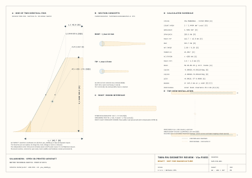

# Salamandra · open 3D-printed FPV aircraft platform

**A free, community-driven platform for fixed-wing FPV aircraft — where every number
carries its source and the reasoning is the deliverable.**

<!-- BEGIN GENERATED: drawing-hero · calculations/drawing_index.py · do not edit by hand -->

[](geometry/drawings/SLM-GA-001-general-arrangement.svg)

<sub>**SLM-GA-001 · General arrangement** — A3 · 1:4 · generated from the calculations, **DRAFT — NOT FOR MANUFACTURE**. The complete set is [below](#drawing-set--generated-design-review-sheets).</sub>

<!-- END GENERATED: drawing-hero -->

**Revision 1.20** · 19 August 2026 · **Release [`v0.6.0`](docs/16-release-v0.6.md)** ·
**Phase 1 in progress** · [CERN-OHL-S-2.0 + CC BY-SA 4.0](#licence)

> 📖 **Read this project as a website:** <https://bultodepapas.github.io/salmandra/>
> — searchable, with auto-generated indexes and an onboarding guide.

---

## Start here

| If you want to… | Go to |
|---|---|
| **Understand the idea** | [What this project is](#what-this-project-is) |
| **See the aircraft** | [Salamandra, Article #1](#the-aircraft--salamandra-article-1) · [drawing set](#drawing-set--generated-design-review-sheets) |
| **Build the CAD model** | [**Salamandra Design Guide v0.23**](design/Salamandra-Design-Guide-v0.1.md) — the primary execution spec |
| **Know what is still unknown** | [`gaps/`](gaps/README.md) · [Open Points](design/Design-Guide-Open-Points-v0.1.md) |
| **Trace why a number exists** | [`decisions/`](decisions/README.md) · [`research/`](research/) · [CHANGELOG](CHANGELOG.md) |
| **Reproduce the numbers** | [Tools and reproduction](#tools-and-reproducing-the-numbers) |
| **Contribute a part or a variant** | [Contributing](#contributing) · [CONTRIBUTING.md](CONTRIBUTING.md) |

---

## What this project is

There are dozens of open-source printed wings. Almost none of them publish **why** they
have the geometry they have. And most of them are a single, finished design.

This project is different in two ways:

1. **The reasoning is the product.** Every decision carries its rationale, its source and
   its [confidence level](#confidence-convention), and the mistakes made along the way are
   recorded instead of erased. Anyone can trace where each number and each shape comes
   from.
2. **It is a platform, not a part.** The goal is a continuously evolving, community-driven
   library of aircraft, components, variants and experiments — with this repository as the
   central archive.

It currently targets a PETG forward-swept flying wing, but that is only the first design.

**It is fully free and as open as possible:**

- **Free.** No paywall, no locked files, no licensing fees.
- **Community-driven.** PRs with modifications, improvements and new variants are welcome
  and expected. The platform grows through its contributors.
- **Broad.** Human expertise is especially valuable in experimentation, practical judgment,
  manufacturing and engineering intuition — but contributions are not limited to
  aerodynamics or structures. Decorative parts, visual improvements, equipment mounts and
  other creative modifications are welcome too.
- **Reciprocal.** Under the project's [licences](#licence), derivatives stay open, so the
  whole community benefits from every contribution.

---

## The aircraft — Salamandra, Article #1

**Salamandra** is the first reference design on the platform: a PETG forward-swept flying
wing, modular and configurable, built around a standard center module with interchangeable
wing panels. Efficient FPV cruise flight, with electronics chosen by the builder.

### Measurable objective

| | Value |
|---|---|
| Market reference | **TBS Mojito** — 1.40 Wh/km measured, USD 189.95 |
| **Target** | **≤ 1.15 Wh/km** at 95 km/h |
| Where it comes from | **Propeller matching**, +20 % demonstrated on UIUC data `[D]` |

The initial analysis showed that the Mojito **is not energy-efficient** — it consumes
0.74 Wh/(km·kg), the same as a USD 40 foam wing; its achievement is sustaining that at
2–3× the speed. This design's efficiency does not come from optimistic aerodynamics: it
comes from the propulsion chain, which is where the data say the gap is.

**It is falsifiable.** It is measured with [E2](tests/) and [E3](tests/).

### Cruise configuration

| Parameter | Value | Decision |
|---|---|---|
| Wingspan | 1300 mm | [ADR-0010](decisions/ADR-0010-mission-branch.md) |
| Aspect ratio | 6.0 · S = 0.282 m² `[E]` | [ADR-0004](decisions/ADR-0004-aspect-ratio.md) |
| Quarter-chord sweep | **−15°** | [ADR-0040](decisions/ADR-0040-quarter-chord-sweep.md) |
| **t/c** | **13.5 % root / 9 % tip** | [ADR-0027](decisions/ADR-0027-relative-thickness.md) |
| Airfoil | **Salamandra r1:** MH60 mean line, +1.0°/+0.5° root/tip reflex | [ADR-0041](decisions/ADR-0041-salamandra-r1-airfoil-family.md) |
| Printed wash-in | **+3.0°**; selected physical-elevon model trims −0.14°…+0.50° at the corrected V1 mass `[D]` | [ADR-0041](decisions/ADR-0041-salamandra-r1-airfoil-family.md), [ADR-0045](decisions/ADR-0045-article-1-elevon-geometry.md) |
| Material | **Conventional PETG** primary airframe; V1 fin shells use bounded LW-PLA-HT pending F2 coupons | [ADR-0021](decisions/ADR-0021-base-material.md), [ADR-0038](decisions/ADR-0038-fixed-fin-variant.md) |
| Perimeters / infill | 2 (0.9 mm) / **gyroid 5 %** | [ADR-0028](decisions/ADR-0028-gyroid-infill.md) |
| Section | Three cells: D-box + center + hinge | [ADR-0002](decisions/ADR-0002-closed-shell.md) |
| Carbon | Bending tube + pin. **Not torsional** | [ADR-0015](decisions/ADR-0015-carbon-non-torsional.md) |
| Elevons | **0.28 c, y 227.5…585 mm (35–90 %), 357.5 mm; fixed 32.5 mm root bridge and 65 mm tip; servo y ±406.25 mm** | [ADR-0045](decisions/ADR-0045-article-1-elevon-geometry.md) |
| AUW (6S1P) | **1553.25 g CLEAN / 44.1 km/h; coupled twin-fin V1 1601.98 g / 44.74 km/h** | [ADR-0038](decisions/ADR-0038-fixed-fin-variant.md), [I-30](research/I-30-fin-station-mass-cg-and-connected-scene-closure.md) |
| Propulsion | **APC E 8×8, 6S1P, 500–550 Kv; two-servo O1 boundary J 0.918 / 8,484 rpm / drag ≤2.12 N** | [ADR-0042](decisions/ADR-0042-cruise-propulsion-equilibrium.md) |
| Target CG | **−93.8 mm** from root c/4 | [ADR-0040](decisions/ADR-0040-quarter-chord-sweep.md) |
| V_NE article #1 | **160 km/h** (design 180) | — |
| Initial V_limit | **105 km/h**; 150 only after GXY validation | [`docs/07`](docs/07-divergence-margin.md) |
| Avionics | INAV 9.1+ or ArduPlane · **pitot mandatory** | — |
| **Directional** | **CLEAN (finless, O1 build) / V1 (fixed fin, first variant)** | [ADR-0038](decisions/ADR-0038-fixed-fin-variant.md) |

### Modular architecture

```
CORE-1          Center module. Wing joiners up to ~30 % of half-span,
                battery bay with longitudinal adjustment, avionics, motor mount.

PANEL-xxxx-y    xxxx = resulting total wingspan · y = airfoil family
```

| Config | Panels | Suggested battery | Use | Status |
|---|---|---|---|---|
| **Range** | 1600 | 4S2P Li-Ion 21700 | Maximum range | Design |
| **Cruise** | 1300 | 6S1P Li-Ion 21700 | **Article #1** | Design |
| **Sport** | 1100 | 6S LiPo | Fast flight | Design |

**Directional variants ([ADR-0038](decisions/ADR-0038-fixed-fin-variant.md)):**
`SALAMANDRA-CLEAN` (finless, O1 efficiency build) and `SALAMANDRA-V1` (two passive
CORE-rooted fixed fins wholly forward of the fixed propeller hazard, no movable rudder —
first platform variant, I-30, recommended after F2 closure). The twin-fin/support assembly
is a CORE module; panels are untouched.

> ⚠️ See [ADR-0032](decisions/ADR-0032-modularity.md): the panels **are not arbitrary**.
> Each set is designed against a common neutral point. The same discipline applies to every
> new configuration contributed to the platform.

### Where the platform can go

- **Replaceable wings.** Larger or differently shaped wings can be swapped onto the common
  center module.
- **Body variants.** Complete fuselage variations, larger fuselages, different wingtips,
  alternative rudders and control surfaces.
- **Different configurations.** The platform is not limited to the current forward-swept
  flying wing. Future directions may include conventional fuselage designs, V-tail
  configurations, tractor or pusher propulsion, and many other layouts.
- **Hardware archive.** This repository is also the central archive for adapters and
  mounting systems for different FPV equipment, electronics, propulsion systems and
  related hardware.

---

## Drawing set — generated design-review sheets

The complete Article #1 set. These A3 metric sheets are **generated, not drawn**:
[`calculations/generate_blueprints.py`](calculations/generate_blueprints.py) renders them
from the canonical planform, the calculated balance solution, the equipment ledger and the
released airfoil coordinates.

They are **technical sketches, not manufacturing drawings**. Dark and blue linework is
traceable geometry, amber dashed linework is provisional, and every sheet states
**DRAFT — NOT FOR MANUFACTURE**. For a scale check, print on A3 at 100 %; browser and wiki
widths are responsive and are not scale references. The full source, graphic and print
contract is in [`geometry/drawings/README.md`](geometry/drawings/README.md); the method is
[I-25](research/I-25-svg-technical-drawing-workflow.md) and the toolchain
[I-26](research/I-26-codex-svg-agent-toolchain.md).

<!-- BEGIN GENERATED: drawing-index · calculations/drawing_index.py · do not edit by hand -->

| Drawing | Purpose | Sheet | Authority |
|---|---|---:|---|
| [`SLM-GA-001`](geometry/drawings/SLM-GA-001-general-arrangement.svg) | Article #1 top-view arrangement: controlled planform, modular stations, CG/NP and continuous provisional fuselage/equipment envelopes | A3 · 1:4 | Planform `[D]`; equipment `[D]`/`[E]`; OML `[I]` |
| [`SLM-FUS-001`](geometry/drawings/SLM-FUS-001-fuselage-oml-review.svg) | Common-source plan, side and transverse body views with inflated central skeleton envelopes, containment margins and gross mesh diagnostics | A3 · views 1:4 / sections 1:1.5 | OML `[I]`; envelopes `[D]`/`[E]`/`[I]`; metrics `[D]` on `[I]` |
| [`SLM-GA-002`](geometry/drawings/SLM-GA-002-side-elevations.svg) | Comparative side elevations: CLEAN finless baseline and V1a twin-fixed-fin test variant, with connected electronics, variant-specific packaging, motor/propeller hazard and rear-view clearance proof | A3 · 1:4 | Root/fin `[D]`/`[E]`; side OML/install `[I]` |
| [`SLM-FIN-001`](geometry/drawings/SLM-FIN-001-fixed-fin-review.svg) | Dedicated V1a twin-fin planform, aerodynamic datum, external leading-edge spar concept, thickness schedule, boom installation and directional-stability screen | A3 · planform 1:1.5 / details NTS | Planform `[D]` on `[E]`; section/install `[E]`/`[I]`; no rudder authority |
| [`SLM-EQP-001`](geometry/drawings/SLM-EQP-001-equipment-mass-skeleton.svg) | Top and side mass skeleton: component envelopes, true mass centres, x/y/z schedule, CLEAN CG and coupled V1 battery/camera/VTX overlay. The top view includes the controlled exterior wing planform as spatial context but no wing construction, fuselage or OML. | A3 · top 1:6.5 / side 1:4 | Planform `[D]`; mass/position ledger `[D]`/`[E]`; open installations `[M]`; no OML authority |
| [`SLM-WNG-001`](geometry/drawings/SLM-WNG-001-half-wing-layout.svg) | Right half-wing: printed segments, cells, spar/pin, ADR-0045 elevon/fixed-root bridge, exact y195 profile and polyhedral inset | A3 · plan 1:2 | Planform/profile/elevon bounds `[D]`; structure/polyhedral `[E]`/`[I]` |

### SLM-GA-001 · General arrangement

[](geometry/drawings/SLM-GA-001-general-arrangement.svg)

Use this sheet to review the whole-aircraft relationship: 1,300 mm controlled planform, modular stations, quarter-chord sweep, CG/NP, nose-boom battery station and rear-pusher envelope. A continuous curved fuselage OML connects the battery fairing, CORE and rear pod so the aircraft reads as one body. That OML is now projected from the common I-28 NumPy loft and central equipment envelopes; it remains `[I]`, amber and provisional until OP-21/F2 freezes the native CAD union and structural interfaces.

**Sheet** A3 · 1:4 · **Authority** Planform `[D]`; equipment `[D]`/`[E]`; OML `[I]`.

### SLM-FUS-001 · Parametric fuselage OML review

[](geometry/drawings/SLM-FUS-001-fuselage-oml-review.svg)

Use this sheet to interrogate the fuselage generator itself. Plan and side outlines and all five transverse sections come from the same asymmetric superelliptic NumPy loft; dashed rectangles are body-owned component envelopes after the explicit 1.2 mm wall plus 1.0 mm installation allowance. The table reports computed containment margins and gross operand metrics. It does not release a printable shell: wing boolean union, local load paths, openings, joints, wall schedule, cooling and body-inclusive aerodynamic closure remain open gates.

**Sheet** A3 · views 1:4 / sections 1:1.5 · **Authority** OML `[I]`; envelopes `[D]`/`[E]`/`[I]`; metrics `[D]` on `[I]`.

### SLM-GA-002 · Side elevations

[](geometry/drawings/SLM-GA-002-side-elevations.svg)

Use this sheet to compare the two published directional configurations without changing the common wing or propulsion installation. **SALAMANDRA-CLEAN** is finless; **SALAMANDRA-V1a** adds two passive fixed CORE-rooted fins at y = ±140 mm, wholly forward of the fixed propeller hazard. Neither configuration has a movable rudder. The released root airfoil and calculated V1a fin dimensions are traceable, while the side OML, vertical equipment placement, propeller-clearance keel and fin/pod installation remain `[I]`. The two 18 × 14 mm boom envelopes have 29.4 mm nominal and 13.4 mm residual radial clearance after the explicit 16.0 mm allowance. The rear inset proves their lateral separation where the side projections overlap.

**Sheet** A3 · 1:4 · **Authority** Root/fin `[D]`/`[E]`; side OML/install `[I]`.

### SLM-FIN-001 · V1a twin-fin geometry review

[](geometry/drawings/SLM-FIN-001-fixed-fin-review.svg)

Use this sheet to review one of the two identical passive V1a fins rather than inferring it from the general side elevation. The planform vertices, area, taper, swept leading/trailing edges, derived quarter-chord sweep and AC marker come from one Python geometry object. Root/tip section sketches explain that the Ø3 mm aluminium rod forms an external leading-edge nose in an open seat; they do not claim an impossible enclosed Ø3.2 mm bore inside the 3.0→1.5 mm plate. The top view proves propeller clearance and the uncredited dorsal root fillet remains inside the credited planform. The rear view distinguishes axial projection overlap from physical disk clearance. Saddle detail, hole positions, print compensation, measured mass and E8 flight closure remain provisional. No movable rudder is defined.

**Sheet** A3 · planform 1:1.5 / details NTS · **Authority** Planform `[D]` on `[E]`; section/install `[E]`/`[I]`; no rudder authority.

### SLM-EQP-001 · Equipment mass skeleton

[](geometry/drawings/SLM-EQP-001-equipment-mass-skeleton.svg)

Use this sheet to review mass and packaging rather than shape: component envelopes, true mass centres, the x/y/z schedule, the CLEAN CG and the coupled V1 battery/camera/VTX solution. Envelope fill colour identifies system function while outline style continues to identify maturity. The controlled exterior wing planform appears only as spatial context: the sheet defines no fuselage outer mould line, no wing construction and no manufacturing geometry.

**Sheet** A3 · top 1:6.5 / side 1:4 · **Authority** Planform `[D]`; mass/position ledger `[D]`/`[E]`; open installations `[M]`; no OML authority.

### SLM-WNG-001 · Right half-wing layout

[](geometry/drawings/SLM-WNG-001-half-wing-layout.svg)

Use this sheet to review PANEL segmentation and interfaces. It shows the exact y195 Salamandra r1 coordinate section, but the spar/channel, servo zones, D-box web and polyhedral construction retain their provisional status.

**Sheet** A3 · plan 1:2 · **Authority** Planform/profile/elevon bounds `[D]`; structure/polyhedral `[E]`/`[I]`.

<!-- END GENERATED: drawing-index -->

Regenerate after any upstream change; the same run republishes this section, the drawing
index and the wiki from one manifest:

```bash
python3 calculations/generate_blueprints.py            # render the sheets and republish them
python3 calculations/generate_blueprints.py --check     # read-only staleness gate, also run in CI
```

---

## How this project works

### The AI–human division of labour

AI and the community have complementary roles:

| | What AI does best | What humans do best |
|---|---|---|
| **AI-assisted research** | Aerodynamic analysis, theoretical research, data cross-validation (XFOIL, VLM, propeller matching), design exploration and trade studies | Experimentation, practical judgment, manufacturing experience, engineering intuition, ground/bench/flight testing |
| **Design** | Parametric reasoning, sizing trades, geometric constraints, documentation | Creating the actual 3D parts (Fusion 360 / CAD), CAD detail, and translating research into reliable native models |

Today, AI is still not particularly effective at directly creating reliable, parametric
Fusion 360 models or native CAD files. That is intentional and expected: **the community
creates the actual 3D parts** based on our AI-assisted research, on their own engineering
knowledge, or on a combination of both. The research tells *what* and *why*; the community
provides the *how*.

### Confidence convention

This is the project's central rule. Every quantitative claim carries a tag:

| Tag | Meaning |
|---|---|
| `[M]` | Measured and published by a primary source |
| `[D]` | Derived by calculation from `[M]` data |
| `[E]` | Estimated on declared assumptions |
| `[I]` | Reasoned inference, not verified |

> **Hard rule:** no `[E]` or `[I]` datum supports an irreversible decision without prior verification.
>
> **Corollary:** when better data overturn a conclusion, it is recorded in the [CHANGELOG](CHANGELOG.md) with a correction number.

### Which design document should I use?

These documents have different jobs. They describe the same released aircraft baseline;
they are not competing specifications.

| Document | Use it for | Intended reader | Authority |
|---|---|---|---|
| [**Salamandra Design Guide v0.23**](design/Salamandra-Design-Guide-v0.1.md) | Building and reviewing the CAD model: geometry, interfaces, equipment envelopes, mass limits and delivery checklist | CAD designer | **Primary CAD execution specification** |
| [**Advanced Design Guide v0.23**](design/Salamandra-Design-Guide-Advanced-v0.1.md) | Detailed engineering limits, calculation results, release migration and complete technical context | Lead designer and engineering reviewer | **Canonical advanced engineering reference** |
| [**Design Guide Justification**](design/Design-Guide-Justification-v0.1.md) | Understanding why each selected value exists and what evidence supports it | Reviewer or contributor challenging a requirement | Rationale and evidence companion |
| [**Design Guide Open Points**](design/Design-Guide-Open-Points-v0.1.md) | Finding provisional values, unresolved gates and the event that can change each value | CAD designer, test engineer and release reviewer | Open-work and change-trigger register |

**Normal CAD workflow:** begin with the concise Design Guide. Open the Advanced Design
Guide only when a requirement needs interpretation. Check the Open Points before freezing
any provisional feature. Use the Justification when reviewing or proposing a change. Both
guides link directly to the
[current manifest-controlled SVG drawing set](geometry/drawings/README.md); begin with
`SLM-GA-001` and select the task-specific sheet from the guide table.

### Releases

Maintainers must follow the
[**New Release Guide**](docs/15-how-to-publish-a-release.md). It defines the version and
document updates, required CI-equivalent checks, release PR, annotated Git tag and
post-release verification. A release is never created from a dirty or partially merged
working tree.

> **📦 Current release — `v0.6.0`: twin-fin directional architecture and the parametric
> fuselage programme.**
>
> The concise Design Guide is the authoritative CAD entry point. v0.5.0 left two shapes as
> sketches; this release replaces both with derivations. The centreline fin is **rejected**
> — its load path crossed the propeller plane — and superseded by two CORE-rooted fixed
> fins at y = ±140 mm whose station comes out of a coupled clearance/mass/CG trade
> ([ADR-0038](decisions/ADR-0038-fixed-fin-variant.md), I-29/I-30): 6.1437 dm² total, fin
> AC x = +115.5 mm, 48.73 g against a 60 g allocation, V1 1601.98 g at 44.74 km/h. The
> fuselage stops being hand-placed Bézier curves in the drawing generator:
> `fuselage_geometry.py` now lofts a superelliptic body around the equipment skeleton and
> **audits containment**, `fuselage_trade.py` scores candidate families, and the review
> selection ships as a hashed mesh. **The body is still `[I]`** — `aircraft_feasible` is
> false and the release says so. Two new sheets (`SLM-FUS-001`, `SLM-FIN-001`) bring the
> set to six.
>
> Read the [**v0.6.0 release notes**](docs/16-release-v0.6.md) before CAD or structural
> work; **any V1 fin or carrier solid from v0.5.0 is obsolete**. Historical v0.1.0–v0.5.0
> notes remain audit records. The wiki renders the package at
> <https://bultodepapas.github.io/salmandra/>.

---

## Status

| Phase | Status |
|---|---|
| 0 — Specification | ✅ **Closed** |
| **1 — Geometry and stability** | 🔄 In progress · see [`docs/03-phase-1-plan.md`](docs/03-phase-1-plan.md) |
| 2 — Weights and balancing | ⬜ |
| 3 — Performance | ⬜ |
| 4 — Loads and structure | ⬜ |
| 5 — Systems and propulsion | ⬜ |
| 6 — Manufacturing and release | ⬜ |

**Current physical gates:** E2 measured r1 polar/stall acceptance, F2 CAD/weighed mass,
OP-29 measured torsional stiffness/elastic axis and G11 dynamic gust closure before the
speed envelope can expand beyond 105 km/h. Airfoil coordinate generation is no longer a
CAD blocker.

<details>
<summary><strong>Phase-1 detail (2026-08-18)</strong> — gap-by-gap state of the geometry and stability work</summary>

- **G8 (neutral point) — largely closed.** On the ADR-0040 −15° planform, NP =
  **25.72 % MAC / −75.8 mm** by the full panel VLM, cross-checked by Weissinger-L at
  **27.0 % / −72.9 mm (2.9 mm agreement)** ([I-21](research/I-21-sweep-trade-and-elastic-axis-correction.md)). The
  central-body effect remains unquantified and moves the NP forward.
- **G2 (airfoil) — closed for CAD, open for measured acceptance.** The corrected B3
  pipeline preserves the mean line, invalidates stale polar caches and uses the local
  Reynolds envelope. The released Salamandra r1 family integrates root/tip moments with
  c² weights and, with the selected physical-elevon effectiveness, trims at
  **−0.14°…+0.50° neutral elevon** with +3.0° wash-in
  ([ADR-0041](decisions/ADR-0041-salamandra-r1-airfoil-family.md),
  [ADR-0045](decisions/ADR-0045-article-1-elevon-geometry.md)); E2 remains mandatory.
- **ADR-0040/0043/0045 — coupled planform, control surface, mass and balance updated.** The −15° planform
  and target CG **−93.8 mm** remain. With Article #1 hardware and the 550 g PETG-shell
  cap and two-servo baseline, CLEAN is **1553.25 g**. Its component-level pack solution
  is **−337.74 mm** inside current travel. The coupled twin-fin V1 solver leaves the nose
  unchanged and converges at battery x = **−363.27 mm**, camera x = −445.98 mm and VTX
  x = −418.00 mm. Current stations and acceptance gates are in the
  [guide §7.2](design/Salamandra-Design-Guide-v0.1.md) and
  [justification §3.2](design/Design-Guide-Justification-v0.1.md); tools in
  `calculations/balance_cg.py` and `calculations/elevon_authority.py`.
- **Twin-fin V1 is analytically below the stall ceiling.** The two LW-PLA-HT
  shells/mounts, two LE spars and two short root supports total **48.73 g** against a
  60.00 g allocation. No forward support is added; V1 is **1601.98 g / 44.74 km/h**,
  about 18.4 g below the exact 45 km/h mass ceiling. Material coupons, CAD, CG and
  scale-mass verification remain mandatory.
- **OP-29 (divergence) — operationally bounded, structurally open.** Revision 4 uses
  the released r1 profile. Nominal Vdiv is 327.2 km/h, but the conservative unmeasured
  case is **129.6 km/h**; initial **Vlimit = 105 km/h**. S3 GJ,
  GXY and elastic-axis measurements plus E7 Southwell expansion are mandatory.
- **C33/G11 — load meanings fixed; dynamic gust remains open.** +6/−3 g are
  provisional manoeuvre limit loads; +9/−4.5 g are the corresponding 1.5× ultimate
  structural cases, not flight targets. The positive V-n branch gives VA **109.0 km/h
  CLEAN / 110.4 km/h V1**. A unit-checked regulatory-reference gust transfer leaves the
  linear CL range, so it is a screening flag rather than an adopted design load
  ([I-24](research/I-24-flight-load-envelope.md), [ADR-0044](decisions/ADR-0044-flight-load-envelope.md)).
- **G10 (directional stability) — bounded by calculation (I-29, ADR-0038).** The
  finless baseline is estimated **directionally unstable** (Cnβ −0.00055…−0.00141/deg
  `[E]`, FSW + nose boom); the platform now publishes two configurations:
  **SALAMANDRA-CLEAN** (finless, O1 efficiency build) and **SALAMANDRA-V1** (two fixed
  CORE-rooted fins forward of the fixed propeller hazard, no movable rudder): V1a
  S_v,total **6.1437 dm²**, 48.73 g lower assembly and ΔCD0 +0.0034 `[D]`/`[E]`
  (`calculations/yaw_stability.py`). A movable
  rudder remains a future control variant; it is not needed to define passive stability. Closure by
  flight test **E8** (yaw perturbation).

</details>

---

## Repository map

| Folder | What it contains |
|---|---|
| [`design/`](design/) | **Concise Salamandra Design Guide v0.23** — the primary CAD execution specification; plus the canonical Advanced Design Guide, justification and open points |
| [`docs/`](docs/) | Specification, status, phase plan, conventions, [master plan up to the first prototype](docs/05-master-plan.md) |
| [`decisions/`](decisions/) | **One file per decision (ADR)**: context, alternatives, consequences |
| [`research/`](research/) | **Research threads**: what was searched, what was found, what sources |
| [`gaps/`](gaps/) | Register of what we do **not** know and how it gets closed |
| [`tests/`](tests/) | Experimental program and data |
| [`calculations/`](calculations/) | Analysis scripts, with validation cases — **full reproduction guide in its README** |
| `geometry/` `stl/` `cad/` | Community 3D parts and outputs; `geometry/airfoils/` holds controlled section coordinates and `geometry/drawings/` holds generated A3 SVG design-review sheets |
| [`wiki/`](wiki/) | **The served documentation site** (Astro Starlight): onboarding guide, auto-generated indexes, search. Deployed to GitHub Pages via `.github/workflows/docs.yml` |

**Reading order for a newcomer:**
[`docs/00-objectives-and-requirements.md`](docs/00-objectives-and-requirements.md) →
[`decisions/README.md`](decisions/README.md) → [`gaps/README.md`](gaps/README.md)

---

## Tools and reproducing the numbers

The project runs on an explicit toolchain — every tool is named, versioned, and used for
a defined job, from research to flight:

| Stage | Tool | Role |
|---|---|---|
| **Research** | Web search via **Firecrawl MCP** | Primary-source search; every query and source logged in [`research/`](research/) |
| **Analysis** | Python 3.11 + numpy | In-house panel VLM, Weissinger-L independent check, sizing, balance and screening harnesses |
| **Aerodynamics** | **XFOIL** 6.99 (official MIT build, GPL) | Airfoil polar generation for the B3 screening and the E387 calibration |
| **Input data** | UIUC Airfoil Data Site, aerodesign.de | Measured/published data (`[M]`); coordinates in `geometry/airfoils/` |
| **Design** | **Fusion 360** (connected via an MCP server) | Community parametric CAD; STL/STEP export for printing and sharing |
| **Manufacturing** | Bambu Studio · 256 mm printer (P1S class) · **PETG** | Printability is a hard requirement (O3/O4), not an afterthought |
| **Avionics** | INAV 9.1+ / ArduPlane · pitot + blackbox | Flight control and the measuring instruments of the whole test program |

Every **derived** quantitative claim is tied to a rerunnable analysis. Measured inputs
retain their source and test conditions; estimates and inferences retain their declared
assumptions and closure gates. The full guide (versions, commands, batch quirks and
validation discipline) is in [`calculations/README.md`](calculations/README.md).

The current high-value results reproduce with:

```bash
python3 calculations/verify_calculations.py        # fast cross-module contracts
python3 calculations/verify_calculations.py --all-scripts  # deterministic local suite
python3 calculations/vlm_ala_volante.py       # NP (I-07)
python3 calculations/weissinger_np.py         # C2 independent NP check (I-15 §6.3)
python3 calculations/airfoil_reflex_trade.py --xfoil /path/to/xfoil.exe  # r1 coordinates/trim
python3 calculations/propulsion_match.py      # APC E 8x8 O1 power/drag boundary
python3 calculations/mass_budget.py --config all  # Article #1 allocation and variants
python3 calculations/balance_cg.py            # coupled 6S1P station / nose-boom sizing
```

Each script ships validation cases. The system verifier also checks that geometry,
mass, battery, CG, stall, power, propulsion, stability and structural modules use the
same design contract; a modification that breaks either level is not accepted.

---

## Contributing

This is a community project. Contributions of all kinds are welcome — see
[CONTRIBUTING.md](CONTRIBUTING.md). In short:

- Contributions that **raise the confidence level of a datum** (measurements, corrections,
  replications) are the highest value.
- **Any new part, variant or configuration** — wings, fuselages, wingtips, rudders,
  control surfaces, mounts, adapters, decorative or creative pieces — is welcome.
- Numbers without a source are not accepted in the technical record, even if they are
  correct.

---

## Licence

This is free and open hardware.

- **Hardware design and 3D models** (CAD/STL), geometry, and the analysis/design scripts
  are licensed under the **CERN Open Hardware Licence Version 2 — Strongly Reciprocal**
  (CERN-OHL-S-2.0). See [`LICENSE`](LICENSE).
- **Documentation** (the `.md` files) is licensed under
  **Creative Commons Attribution-ShareAlike 4.0** (CC BY-SA 4.0). See
  [`LICENSE-docs.md`](LICENSE-docs.md).

Both licences are reciprocal: derivatives of the community's work stay open, so the whole
platform benefits from every contribution.
