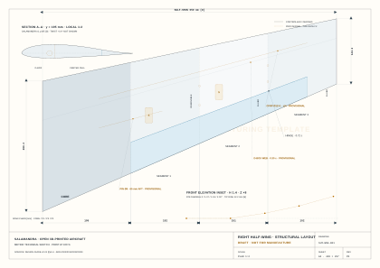

# 3D-printed FPV aircraft platform — open, modular, AI-assisted

<!-- BEGIN GENERATED: drawing-hero · calculations/drawing_index.py · do not edit by hand -->

[](geometry/drawings/SLM-GA-001-general-arrangement.svg)

<sub>**SLM-GA-001 · General arrangement** — A3 · 1:4 · generated from the calculations, **DRAFT — NOT FOR MANUFACTURE**. The complete set is [below](#drawing-set--generated-design-review-sheets).</sub>

<!-- END GENERATED: drawing-hero -->

A completely free, community-driven platform for 3D-printed fixed-wing FPV aircraft.
The core design principles are developed largely through **AI-assisted research**, while the
**final aircraft and its 3D models are created collaboratively by humans and AI**.

This is an **evolving platform**, not a single aircraft. It currently targets a PETG
forward-swept flying wing, but that is only the first design. The repository is meant to
grow into a whole family of airframes, parts, adapters and experiments — contributed by
the community.

**Revision 1.18** · 18 August 2026 · **Release v0.5.0 · Phase 1 in progress**

> 📖 **Read this project as a website:** <https://bultodepapas.github.io/salmandra/>
> — searchable, with auto-generated indexes and an onboarding guide.

---

## Drawing set — generated design-review sheets

The complete Article #1 set. These A3 metric sheets are **generated, not drawn**:
[`calculations/generate_blueprints.py`](calculations/generate_blueprints.py) renders them
from the canonical planform, the calculated balance solution, the equipment ledger and the
released airfoil coordinates.

<!-- BEGIN GENERATED: drawing-index · calculations/drawing_index.py · do not edit by hand -->

| Drawing | Purpose | Sheet | Authority |
|---|---|---:|---|
| [`SLM-GA-001`](geometry/drawings/SLM-GA-001-general-arrangement.svg) | Article #1 top-view arrangement: controlled planform, modular stations, CG/NP and continuous provisional fuselage/equipment envelopes | A3 · 1:4 | Planform `[D]`; equipment `[D]`/`[E]`; OML `[I]` |
| [`SLM-GA-002`](geometry/drawings/SLM-GA-002-side-elevations.svg) | Comparative side elevations: CLEAN finless baseline and V1a fixed-fin test variant, with common root section, packaging, motor/propeller and keel clearance | A3 · 1:4 | Root/fin `[D]`/`[E]`; side OML/install `[I]` |
| [`SLM-EQP-001`](geometry/drawings/SLM-EQP-001-equipment-mass-skeleton.svg) | Top and side mass skeleton: component envelopes, true mass centres, x/y/z schedule, CLEAN CG and V1 battery-stop overlay. The top view includes the controlled exterior wing planform as spatial context but no wing construction, fuselage or OML. | A3 · top 1:6.5 / side 1:4 | Planform `[D]`; mass/position ledger `[D]`/`[E]`; open installations `[M]`; no OML authority |
| [`SLM-WNG-001`](geometry/drawings/SLM-WNG-001-half-wing-layout.svg) | Right half-wing: printed segments, cells, spar/pin, ADR-0045 elevon/fixed-root bridge, exact y195 profile and polyhedral inset | A3 · plan 1:2 | Planform/profile/elevon bounds `[D]`; structure/polyhedral `[E]`/`[I]` |

### SLM-GA-001 · General arrangement

[](geometry/drawings/SLM-GA-001-general-arrangement.svg)

Use this sheet to review the whole-aircraft relationship: 1,300 mm controlled planform, modular stations, quarter-chord sweep, CG/NP, nose-boom battery station and rear-pusher envelope. A continuous curved fuselage OML connects the battery fairing, CORE and rear pod so the aircraft reads as one body. Its required stations are sourced, but its Bézier transitions remain `[I]`, amber and provisional until OP-21/F2 freezes native CAD.

**Sheet** A3 · 1:4 · **Authority** Planform `[D]`; equipment `[D]`/`[E]`; OML `[I]`.

### SLM-GA-002 · Side elevations

[](geometry/drawings/SLM-GA-002-side-elevations.svg)

Use this sheet to compare the two published directional configurations without changing the common wing, boom, battery or propulsion installation. **SALAMANDRA-CLEAN** is finless; **SALAMANDRA-V1a** adds a passive fixed centreline fin. Neither configuration has a movable rudder. The released root airfoil and calculated V1a fin dimensions are traceable, while the side OML, vertical equipment placement, propeller-clearance keel and fin/pod installation remain `[I]`. The drawing also flags the open 105 mm fin-root versus x = +295 mm pod-extension interface for native CAD resolution.

**Sheet** A3 · 1:4 · **Authority** Root/fin `[D]`/`[E]`; side OML/install `[I]`.

### SLM-EQP-001 · Equipment mass skeleton

[](geometry/drawings/SLM-EQP-001-equipment-mass-skeleton.svg)

Use this sheet to review mass and packaging rather than shape: component envelopes, true mass centres, the x/y/z schedule, the CLEAN CG and the V1 battery-stop overlay. Envelope fill colour identifies system function while outline style continues to identify maturity. The controlled exterior wing planform appears only as spatial context: the sheet defines no fuselage outer mould line, no wing construction and no manufacturing geometry.

**Sheet** A3 · top 1:6.5 / side 1:4 · **Authority** Planform `[D]`; mass/position ledger `[D]`/`[E]`; open installations `[M]`; no OML authority.

### SLM-WNG-001 · Right half-wing layout

[](geometry/drawings/SLM-WNG-001-half-wing-layout.svg)

Use this sheet to review PANEL segmentation and interfaces. It shows the exact y195 Salamandra r1 coordinate section, but the spar/channel, servo zones, D-box web and polyhedral construction retain their provisional status.

**Sheet** A3 · plan 1:2 · **Authority** Planform/profile/elevon bounds `[D]`; structure/polyhedral `[E]`/`[I]`.

<!-- END GENERATED: drawing-index -->

They are **technical sketches, not manufacturing drawings**. Dark and blue linework is
traceable geometry, amber dashed linework is provisional, and every sheet states
**DRAFT — NOT FOR MANUFACTURE**. For a scale check, print on A3 at 100 %; browser and wiki
widths are responsive and are not scale references. The full source, graphic and print
contract is in [`geometry/drawings/README.md`](geometry/drawings/README.md); the method is
[I-25](research/I-25-svg-technical-drawing-workflow.md) and the toolchain
[I-26](research/I-26-codex-svg-agent-toolchain.md).

Regenerate after any upstream change; the same run republishes this section, the drawing
index and the wiki from one manifest:

```bash
python3 calculations/generate_blueprints.py           # render the sheets and republish them
python3 calculations/generate_blueprints.py --check    # read-only staleness gate, also run in CI
```

---

## What this project is

There are dozens of open-source printed wings. Almost none of them publish **why** they
have the geometry they have. And most of them are a single, finished design.

This project is different in two ways:

1. **The reasoning is the product.** Every decision carries its rationale, its source and
   its confidence level, and the mistakes made along the way are recorded instead of
   erased. Anyone can trace where each number and each shape comes from.
2. **It is a platform, not a part.** The goal is a continuously evolving, community-driven
   library of aircraft, components, variants and experiments — with this repository as the
   central archive.

**It is fully free and as open as possible.** Contributors are encouraged to open pull
requests with modifications, improvements and new variants.

---

## The AI–human workflow

AI and the community have complementary roles:

| | What AI does best | What humans do best |
|---|---|---|
| **AI-assisted research** | Aerodynamic analysis, theoretical research, data cross-validation (XFOIL, VLM, propeller matching), design exploration and trade studies | Experimentation, practical judgment, manufacturing experience, engineering intuition, ground/bench/flight testing |
| **Design** | Parametric reasoning, sizing trades, geometric constraints, documentation | Creating the actual 3D parts (Fusion 360 / CAD), CAD detail, and translating research into reliable native models |

Today, AI is still not particularly effective at directly creating reliable, parametric
Fusion 360 models or native CAD files. That is intentional and expected: **the community
creates the actual 3D parts** based on our AI-assisted research, on their own engineering
knowledge, or on a combination of both.

The repository is built so the two can meet: the research and analysis tell *what* and
*why*; the community provides the *how* — the parts that realize it.

---

## Why it is open

- **Free.** No paywall, no locked files, no licensing fees. The project is meant to be
  used, built and shared.
- **Community-driven.** PRs with modifications, improvements and new variants are welcome
  and expected. The platform grows through its contributors.
- **Broad contributions.** Human expertise is especially valuable in experimentation,
  practical judgment, manufacturing and engineering intuition — but contributions are not
  limited to aerodynamics or structures. Decorative parts, visual improvements, equipment
  mounts and other creative modifications are welcome too.
- **Reciprocal.** Under the project's licences, derivatives stay open, so the whole
  community benefits from every contribution. See [Licence](#licence).

---

## Modular platform and extensibility

The aircraft is designed as a **modular platform**:

- **Replaceable wings.** Larger or differently shaped wings can be swapped onto the common
  center module.
- **Body variants.** Contributors can create complete fuselage variations, larger
  fuselages, different wingtips, alternative rudders and control surfaces.
- **Different configurations.** The platform is not limited to the current forward-swept
  flying wing. Future directions may include conventional fuselage designs, V-tail
  configurations, tractor or pusher propulsion systems, and many other aircraft layouts.
- **Hardware archive.** This repository is also the central archive for adapters and
  mounting systems for different FPV equipment, electronics, propulsion systems and
  related hardware.

---

## Initial design: Salamandra, the forward-swept flying wing

This is the first, reference design on the platform, named **Salamandra**. Its current
specification for the designer is the
[**Salamandra Design Guide v0.23**](design/Salamandra-Design-Guide-v0.1.md), with the
justification in [`design/`](design/). The baseline is a PETG forward-swept flying wing,
**modular and configurable**: a standard center module and interchangeable wing panels.
Efficient FPV cruise flight, with electronics chosen by the builder.

**📦 Current release — `v0.5.0`: verification integrity and the connected design
contract.** The Design Guide is the authoritative entry point. A measured audit of the 33
calculation modules ([`docs/12`](docs/12-calculation-system-audit-and-remediation.md))
found that v0.4.0's "connected" baseline was partly nominal — twelve quantities declared
twice, a hand-copied neutral point, a factor-1.76 yaw-inertia contradiction, checks that
could not turn red, and a CI that aborted at install time. This release closes that class:
[ADR-0046](decisions/ADR-0046-single-declaration-contract.md) gives every shared quantity
one owner, `contract_lint.py` fails a second declaration, and `mutation_test.py` seeds 19
deliberate defects that must each turn a check red. It also releases the ADR-0045 elevon
geometry (357.5 mm surfaces, two servos) and the four generated A3 drawing sheets.
**One published number moves** — the V1a yaw mode, ω_n 4.03 → 5.35 rad/s. Read the
[**v0.5.0 release notes**](docs/13-release-v0.5.md) before CAD or structural work;
existing 390 mm elevon solids are obsolete. Historical v0.1.0–v0.4.0 notes remain audit
records.
The wiki renders the package at
<https://bultodepapas.github.io/salmandra/>.

### Measurable objective

| | Value |
|---|---|
| Market reference | **TBS Mojito** — 1.40 Wh/km measured, USD 189.95 |
| **Target** | **≤ 1.15 Wh/km** at 95 km/h |
| Where it comes from | **Propeller matching**, +20 % demonstrated on UIUC data `[D]` |

The initial analysis showed that the Mojito **is not energy-efficient** — it consumes
0.74 Wh/(km·kg), the same as a USD 40 foam wing; its achievement is sustaining that at
2–3× the speed. This design's efficiency does not come from optimistic aerodynamics: it
comes from the propulsion chain, which is where the data say the gap is.

**It is falsifiable.** It is measured with [E2](tests/) and [E3](tests/).

### Article #1 — Cruise configuration

| Parameter | Value | Decision |
|---|---|---|
| Wingspan | 1300 mm | [ADR-0010](decisions/ADR-0010-mission-branch.md) |
| Aspect ratio | 6.0 · S = 0.282 m² `[E]` | [ADR-0004](decisions/ADR-0004-aspect-ratio.md) |
| Quarter-chord sweep | **−15°** | [ADR-0040](decisions/ADR-0040-quarter-chord-sweep.md) |
| **t/c** | **13.5 % root / 9 % tip** | [ADR-0027](decisions/ADR-0027-relative-thickness.md) |
| Airfoil | **Salamandra r1:** MH60 mean line, +1.0°/+0.5° root/tip reflex | [ADR-0041](decisions/ADR-0041-salamandra-r1-airfoil-family.md) |
| Printed wash-in | **+3.0°**; selected physical-elevon model trims −0.14°…+0.50° at the corrected V1 mass `[D]` | [ADR-0041](decisions/ADR-0041-salamandra-r1-airfoil-family.md), [ADR-0045](decisions/ADR-0045-article-1-elevon-geometry.md) |
| Material | **Conventional PETG**, light color | [ADR-0021](decisions/ADR-0021-base-material.md) |
| Perimeters / infill | 2 (0.9 mm) / **gyroid 5 %** | [ADR-0028](decisions/ADR-0028-gyroid-infill.md) |
| Section | Three cells: D-box + center + hinge | [ADR-0002](decisions/ADR-0002-closed-shell.md) |
| Carbon | Bending tube + pin. **Not torsional** | [ADR-0015](decisions/ADR-0015-carbon-non-torsional.md) |
| Elevons | **0.28 c, y 227.5…585 mm (35–90 %), 357.5 mm; fixed 32.5 mm root bridge and 65 mm tip; servo y ±406.25 mm** | [ADR-0045](decisions/ADR-0045-article-1-elevon-geometry.md) |
| AUW (6S1P) | **1553.25 g CLEAN / 44.1 km/h; V1 lower model 1596.05 g / 44.7 km/h** | [ADR-0043](decisions/ADR-0043-article-1-mass-allocation.md), [ADR-0045](decisions/ADR-0045-article-1-elevon-geometry.md) |
| Propulsion | **APC E 8×8, 6S1P, 500–550 Kv; two-servo O1 boundary J 0.918 / 8,484 rpm / drag ≤2.12 N** | [ADR-0042](decisions/ADR-0042-cruise-propulsion-equilibrium.md) |
| Target CG | **−93.8 mm** from root c/4 | [ADR-0040](decisions/ADR-0040-quarter-chord-sweep.md) |
| V_NE article #1 | **160 km/h** (design 180) | — |
| Initial V_limit | **105 km/h**; 150 only after GXY validation | [`docs/07`](docs/07-divergence-margin.md) |
| Avionics | INAV 9.1+ or ArduPlane · **pitot mandatory** | — |
| **Directional** | **CLEAN (finless, O1 build) / V1 (fixed fin, first variant)** | [ADR-0038](decisions/ADR-0038-fixed-fin-variant.md) |

### Modular architecture

```
CORE-1          Center module. Wing joiners up to ~30 % of half-span,
                battery bay with longitudinal adjustment, avionics, motor mount.

PANEL-xxxx-y    xxxx = resulting total wingspan · y = airfoil family
```

| Config | Panels | Suggested battery | Use | Status |
|---|---|---|---|---|
| **Range** | 1600 | 4S2P Li-Ion 21700 | Maximum range | Design |
| **Cruise** | 1300 | 6S1P Li-Ion 21700 | **Article #1** | Design |
| **Sport** | 1100 | 6S LiPo | Fast flight | Design |

**Directional variants (ADR-0038):** `SALAMANDRA-CLEAN` (finless, O1 efficiency build)
and `SALAMANDRA-V1` (fixed centreline fin, no rudder — first platform variant, I-20,
recommended for the test programme). The fin is a CORE component; panels are untouched.

⚠️ See [ADR-0032](decisions/ADR-0032-modularity.md): the panels **are not arbitrary**. Each
set is designed against a common neutral point. The same discipline applies to every new
configuration contributed to the platform.

---

## How to navigate this repository

| Folder | What it contains |
|---|---|
| [`design/`](design/) | **Salamandra Design Guide v0.23** — the v0.5.0 controlling CAD specification, its justification and open points; v0.21 remains the v0.4.0 release snapshot |
| [`docs/`](docs/) | Specification, status, phase plan, conventions, [master plan up to the first prototype](docs/05-master-plan.md) |
| [`decisions/`](decisions/) | **One file per decision (ADR)**: context, alternatives, consequences |
| [`research/`](research/) | **Research threads**: what was searched, what was found, what sources |
| [`gaps/`](gaps/) | Register of what we do **not** know and how it gets closed |
| [`tests/`](tests/) | Experimental program and data |
| [`calculations/`](calculations/) | Analysis scripts, with validation cases — **full reproduction guide in its README** |
| `geometry/` `stl/` `cad/` | Community 3D parts and outputs; `geometry/airfoils/` holds controlled section coordinates and `geometry/drawings/` holds generated A3 SVG design-review sheets |
| [`wiki/`](wiki/) | **The served documentation site** (Astro Starlight): onboarding guide, auto-generated indexes, search. Deployed to GitHub Pages via `.github/workflows/docs.yml` |

**Start with:** [`docs/00-objectives-and-requirements.md`](docs/00-objectives-and-requirements.md) → [`decisions/README.md`](decisions/README.md) → [`gaps/README.md`](gaps/README.md)

---

## Confidence convention

This is the project's central rule. Every quantitative claim carries a tag:

| Tag | Meaning |
|---|---|
| `[M]` | Measured and published by a primary source |
| `[D]` | Derived by calculation from `[M]` data |
| `[E]` | Estimated on declared assumptions |
| `[I]` | Reasoned inference, not verified |

> **Hard rule:** no `[E]` or `[I]` datum supports an irreversible decision without prior verification.
>
> **Corollary:** when better data overturn a conclusion, it is recorded in the [CHANGELOG](CHANGELOG.md) with a correction number.

---

## Status

| Phase | Status |
|---|---|
| 0 — Specification | ✅ **Closed** |
| **1 — Geometry and stability** | 🔄 In progress · see [`docs/03-phase-1-plan.md`](docs/03-phase-1-plan.md) |
| 2 — Weights and balancing | ⬜ |
| 3 — Performance | ⬜ |
| 4 — Loads and structure | ⬜ |
| 5 — Systems and propulsion | ⬜ |
| 6 — Manufacturing and release | ⬜ |

**Current physical gates:** E2 measured r1 polar/stall acceptance, F2 CAD/weighed mass,
OP-29 measured torsional stiffness/elastic axis and G11 dynamic gust closure before the
speed envelope can expand beyond 105 km/h. Airfoil coordinate generation is no longer a
CAD blocker.

Phase-1 status (2026-08-18):

- **G8 (neutral point) — largely closed.** On the ADR-0040 −15° planform, NP =
  **25.72 % MAC / −75.8 mm** by the full panel VLM, cross-checked by Weissinger-L at
  **27.0 % / −72.9 mm (2.9 mm agreement)** ([I-21](research/I-21-sweep-trade-and-elastic-axis-correction.md)). The
  central-body effect remains unquantified and moves the NP forward.
- **G2 (airfoil) — closed for CAD, open for measured acceptance.** The corrected B3
  pipeline preserves the mean line, invalidates stale polar caches and uses the local
  Reynolds envelope. The released Salamandra r1 family integrates root/tip moments with
  c² weights and, with the selected physical-elevon effectiveness, trims at
  **−0.14°…+0.50° neutral elevon** with +3.0° wash-in
  ([ADR-0041](decisions/ADR-0041-salamandra-r1-airfoil-family.md),
  [ADR-0045](decisions/ADR-0045-article-1-elevon-geometry.md)); E2 remains mandatory.
- **ADR-0040/0043/0045 — coupled planform, control surface, mass and balance updated.** The −15° planform
  and target CG **−93.8 mm** remain. With Article #1 hardware and the 550 g PETG-shell
  cap and two-servo baseline, CLEAN is **1553.25 g**. Its component-level pack solution
  is **−337.74 mm** inside current travel. V1 requires −373.73 mm, 2.53 mm beyond the
  forward stop, although its CG remains inside the released band. Current stations and acceptance gates are in the
  [guide §7.2](design/Salamandra-Design-Guide-v0.1.md) and
  [justification §3.2](design/Design-Guide-Justification-v0.1.md); tools in
  `calculations/balance_cg.py` and `calculations/elevon_authority.py`.
- **Two-servo correction closes the analytical V1 mass gap.** The complete fin remains
  **42.80 g**, including its mandatory 5.7 g aluminium spar. With 25 g removed from
  actuation and ADR-0045 balance allocation, V1 is **1596.05 g / 44.7 km/h**, about 24.4 g below the exact 45 km/h
  mass ceiling. CAD and scale mass verification remain mandatory.
- **OP-29 (divergence) — operationally bounded, structurally open.** Revision 4 uses
  the released r1 profile. Nominal Vdiv is 327.2 km/h, but the conservative unmeasured
  case is **129.6 km/h**; initial **Vlimit = 105 km/h**. S3 GJ,
  GXY and elastic-axis measurements plus E7 Southwell expansion are mandatory.
- **C33/G11 — load meanings fixed; dynamic gust remains open.** +6/−3 g are
  provisional manoeuvre limit loads; +9/−4.5 g are the corresponding 1.5× ultimate
  structural cases, not flight targets. The positive V-n branch gives VA **109.0 km/h
  CLEAN / 110.4 km/h V1**. A unit-checked regulatory-reference gust transfer leaves the
  linear CL range, so it is a screening flag rather than an adopted design load
  ([I-24](research/I-24-flight-load-envelope.md), [ADR-0044](decisions/ADR-0044-flight-load-envelope.md)).
- **G10 (directional stability) — bounded by calculation (I-20, ADR-0038).** The
  finless baseline is estimated **directionally unstable** (Cnβ −0.0006…−0.0014/deg
  `[E]`, FSW + nose boom); the platform now publishes two configurations:
  **SALAMANDRA-CLEAN** (finless, O1 efficiency build) and **SALAMANDRA-V1** (fixed
  centreline fin, no rudder — first platform variant, recommended for the test
  programme after F2 mass closure): S_v 2.13–2.83 dm², **43–88 g complete**, ΔCD0
  +0.0014–0.0019 `[D]`/`[E]`
  (`calculations/yaw_stability.py`). A movable rudder is **rejected with numbers**
  (I-20 §5.4; Mojito `[M]` flies a fixed stabilizer with elevons only). Closure by
  flight test **E8** (yaw perturbation).

---

## Tools and workflow

The project runs on an explicit toolchain — every tool is named, versioned, and used for
a defined job, from research to flight:

| Stage | Tool | Role |
|---|---|---|
| **Research** | Web search via **Firecrawl MCP** | Primary-source search; every query and source logged in [`research/`](research/) |
| **Analysis** | Python 3.11 + numpy | In-house panel VLM, Weissinger-L independent check, sizing, balance and screening harnesses |
| **Aerodynamics** | **XFOIL** 6.99 (official MIT build, GPL) | Airfoil polar generation for the B3 screening and the E387 calibration |
| **Input data** | UIUC Airfoil Data Site, aerodesign.de | Measured/published data (`[M]`); coordinates in `geometry/airfoils/` |
| **Design** | **Fusion 360** (connected via an MCP server) | Community parametric CAD; STL/STEP export for printing and sharing |
| **Manufacturing** | Bambu Studio · 256 mm printer (P1S class) · **PETG** | Printability is a hard requirement (O3/O4), not an afterthought |
| **Avionics** | INAV 9.1+ / ArduPlane · pitot + blackbox | Flight control and the measuring instruments of the whole test program |

Every **derived** quantitative claim is tied to a rerunnable analysis. Measured inputs
retain their source and test conditions; estimates and inferences retain their declared
assumptions and closure gates. The full guide (versions, commands, batch quirks and
validation discipline) is in [`calculations/README.md`](calculations/README.md).

The current high-value results reproduce with:

```bash
python3 calculations/verify_calculations.py        # fast cross-module contracts
python3 calculations/verify_calculations.py --all-scripts  # deterministic local suite
python3 calculations/vlm_ala_volante.py       # NP (I-07)
python3 calculations/weissinger_np.py         # C2 independent NP check (I-15 §6.3)
python3 calculations/airfoil_reflex_trade.py --xfoil /path/to/xfoil.exe  # r1 coordinates/trim
python3 calculations/propulsion_match.py      # APC E 8x8 O1 power/drag boundary
python3 calculations/mass_budget.py --config all  # Article #1 allocation and variants
python3 calculations/balance_cg.py            # coupled 6S1P station / nose-boom sizing
```

Each script ships validation cases. The system verifier also checks that geometry,
mass, battery, CG, stall, power, propulsion, stability and structural modules use the
same design contract; a modification that breaks either level is not accepted.

---

## Contributing

This is a community project. Contributions of all kinds are welcome — see
[CONTRIBUTING.md](CONTRIBUTING.md). In short:

- Contributions that **raise the confidence level of a datum** (measurements, corrections,
  replications) are the highest value.
- **Any new part, variant or configuration** — wings, fuselages, wingtips, rudders,
  control surfaces, mounts, adapters, decorative or creative pieces — is welcome.
- Numbers without a source are not accepted in the technical record, even if they are
  correct.

## Licence

This is free and open hardware.

- **Hardware design and 3D models** (CAD/STL), geometry, and the analysis/design scripts
  are licensed under the **CERN Open Hardware Licence Version 2 — Strongly Reciprocal**
  (CERN-OHL-S-2.0). See [`LICENSE`](LICENSE).
- **Documentation** (the `.md` files) is licensed under
  **Creative Commons Attribution-ShareAlike 4.0** (CC BY-SA 4.0). See
  [`LICENSE-docs.md`](LICENSE-docs.md).

Both licences are reciprocal: derivatives of the community's work stay open, so the whole
platform benefits from every contribution.
