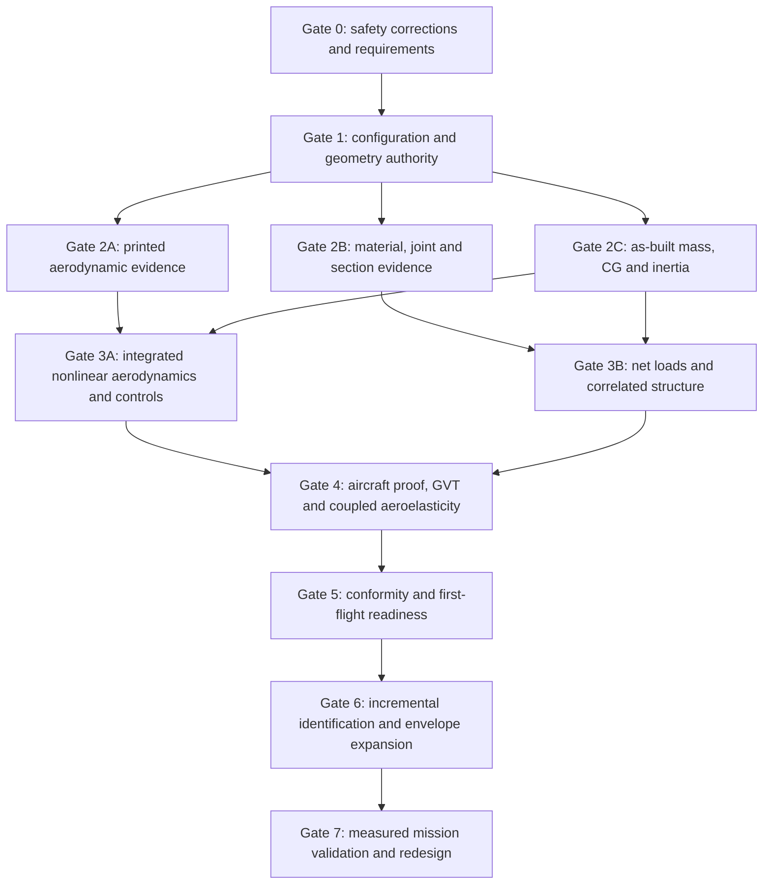

# NF Design Guide 2024 — Consolidated Salamandra Audit and Release Programme

**Document role:** single engineering decision, risk and verification roadmap derived from
the six-part NF Design Guide repository audit

**Audit baseline:** Salamandra Article #1, repository release v0.6.0, Design Guide v0.24

**Audit date:** 20 August 2026 · **Priority-1 implementation update:** 21 August 2026

**Technical authority:** preliminary design review only — not manufacturing or flight
release

## 1. Authority and disposition

This document is the **single consolidated engineering programme** for applying Peter
Wick's *Designing Flying Wings* to Salamandra Article #1. It supersedes the six individual
parts as the day-to-day source for:

- configuration disposition;
- prioritized risks;
- required calculations and physical tests;
- dependency and gate sequencing;
- acceptance criteria; and
- repository, CAD, manufacturing and flight-release status.

The six parts remain controlled technical annexes because they contain the detailed
derivations, PDF page mapping and model limitations. They are evidence, not competing
roadmaps.

**Overall disposition:**

> Salamandra is a rigorous and unusually traceable preliminary design. It does not yet
> have a manufacturing-authoritative aircraft, validated low-Reynolds-number aerodynamics,
> robust directional stability, substantiated printed structure or flutter clearance.
> Manufacturing release and first flight remain blocked.

The recommended near-term baseline is:

| Item | Consolidated decision |
|---|---|
| Development configuration | **SALAMANDRA-V1**, with reversible CORE-rooted twin fins, is the only first-flight development candidate after all gates close. It is not currently approved to fly. |
| CLEAN configuration | Retain as the low-drag O1 research/reference configuration; do not use for first-flight planning while its directional instability remains unresolved. |
| Planform | Retain the current 1.300 m, 0.282 m², AR 5.993, taper 0.50, −15° quarter-chord-sweep geometry as the analytical Article #1 baseline. Reopen the architecture trade before irreversible production CAD. |
| Airfoil and twist | **ADR-0047 hold:** retain r1 only as reference/coupon geometry. Test r2a at +3.0°/+2.5° root/tip reflex and +3° wash-in; release neither until E2A closes. |
| Static margin | r1's 8% target is historical. Test r2a at **5% nominal SM** over the complete 2.777–7.223% CG-band range; this is a passive, statically stable candidate, not authorization for neutral/negative-margin flight. |
| Elevons | Retain 28% chord, 35–90% semispan and two servos provisionally. Release no flap, flaperon or brake schedule. |
| Wingtips | Retain flat caps. Add no winglet or aft-set tip device to Article #1. |
| Directional surfaces | Retain V1 fins as reversible test hardware; credit no unmeasured slipstream or induced-drag benefit. |
| Speed | Retain 105 km/h only as an analytical upper restriction. It is not permission to fly. The 160 km/h `VNE` remains an unsubstantiated target. |
| Active stability | Excluded from Article #1. Neutral and negative-margin concepts require new packaging, controls and safety qualification. |
| Manufacturing | Blocked until native CAD, material/process specifications and conformity data exist. |
| Flight | Blocked until every consolidated P0 gate is closed with measured or correlated evidence. |

## 2. Source and traceability

### 2.1 Reviewed source

```text
/home/bulto/salmandra/INSPIRATION/NF Design guide 2024 english.pdf
PDF pages: 331
SHA-256: a0e81c98b884c7a9c29f75a9bd7ccdf19ff2255642ba2ac5bdd4337696daabca
```

The book is an expert model-flying-wing design guide, not a certification specification.
Its experience trends are used to expose interactions and define questions. No empirical
rule is transferred to Salamandra without aircraft-specific calculation or test.

### 2.2 Technical annexes and reproducible evidence

| Annex | Primary scope | Reproducible calculation |
|---|---|---|
| [Part 1 — Full-book triage](NF-Design-Guide-2024-Repository-Audit.md) | Configuration, release maturity and full-guide coverage | [`nf_design_guide_audit.py`](../calculations/nf_design_guide_audit.py) |
| [Part 2 — Airfoil and trim](NF-Design-Guide-2024-Repository-Audit-Part-02-Airfoil-Trim.md) | Low-Re moment, trailing edge, trim, static margin and pitch dynamics | [`nf_design_guide_part2_airfoil_trim.py`](../calculations/nf_design_guide_part2_airfoil_trim.py) |
| [Part 3 — Directional stability](NF-Design-Guide-2024-Repository-Audit-Part-03-Directional-Stability.md) | Fin behavior, finite sideslip, modes, adverse yaw, launch and landing | [`nf_design_guide_part3_directional_stability.py`](../calculations/nf_design_guide_part3_directional_stability.py) |
| [Part 4 — Structure and aeroelasticity](NF-Design-Guide-2024-Repository-Audit-Part-04-Structure-Aeroelasticity.md) | Loads, materials, joints, divergence, flutter, GVT and manufacturing authority | [`nf_design_guide_part4_structure_aeroelasticity.py`](../calculations/nf_design_guide_part4_structure_aeroelasticity.py) |
| [Part 5 — Wingtips and flap management](NF-Design-Guide-2024-Repository-Audit-Part-05-Wingtips-Drag-Flaps.md) | Induced/parasite drag, tip yaw arm, outer-wing reserve and control states | [`nf_design_guide_part5_wingtip_efficiency.py`](../calculations/nf_design_guide_part5_wingtip_efficiency.py) |
| [Part 6 — Design-method synthesis](NF-Design-Guide-2024-Repository-Audit-Part-06-Design-Method-Synthesis.md) | Geometry quality, section plane, statewise loading, active stability and flap chord | [`nf_design_guide_part6_design_synthesis.py`](../calculations/nf_design_guide_part6_design_synthesis.py) |

The default evidence can be regenerated with:

```bash
python3 -m pip install -r calculations/requirements.txt

python3 calculations/nf_design_guide_audit.py
python3 calculations/nf_design_guide_part2_airfoil_trim.py
python3 calculations/nf_design_guide_part3_directional_stability.py
python3 calculations/nf_design_guide_part4_structure_aeroelasticity.py
python3 calculations/nf_design_guide_part5_wingtip_efficiency.py
python3 calculations/nf_design_guide_part6_design_synthesis.py

python3 calculations/verify_calculations.py
python3 calculations/mutation_test.py
```

Optional XFOIL sensitivities in Part 2 require an official XFOIL 6.99 executable. The
default audit does not silently run or substitute those external cases.

Evidence tags have one meaning throughout:

- `[M]`: measured on a relevant physical item;
- `[D]`: derived reproducibly from controlled inputs;
- `[E]`: engineering estimate or transferred empirical input; and
- `[I]`: audit inference or incomplete-model diagnostic.

Passing software checks proves numerical consistency, not physical validity.

## 3. Controlled Article #1 analytical baseline

| Parameter | Current value | Authority and limitation |
|---|---:|---|
| Span / reference area | 1.300 m / 0.282 m² | Controlled geometry `[D]` |
| Aspect ratio / taper | 5.993 / 0.50 | Controlled geometry `[D]` |
| Quarter-chord sweep | −15.000° | ADR-0040 selection inside a restricted trade |
| Root / tip chord | 289.231 / 144.615 mm | Derived from planform |
| Root / tip t/c | 13.5 / 9.0% nominal | Retained in r2a; as-printed contour unmeasured |
| Root / tip reflex | r1 +1.0°/+0.5°; r2a **+3.0°/+2.5°** | r2a is an XFOIL/VLM test candidate, not physical validation |
| Printed twist | +3.0° linear wash-in | Retained provisionally in r2a `[D]/[E]` |
| Elevons | 28% chord, eta 0.35–0.90 | Ideal aerodynamic screen; physical response open |
| VLM neutral point | −75.787 mm from root c/4 | Rigid inviscid `[D]` |
| Weissinger neutral point | −72.899 mm | Independent inviscid method `[D]` |
| Target CG | r1 −93.784 mm; r2a **−87.035 mm** | r2a is 5% MAC ahead of VLM NP; F2 reach open |
| Released CG band | ±5.0 mm | Physical target; control-envelope closure open |
| CLEAN mass | 1553.25 g | Analytical allocation; as-built absent |
| V1 lower-model mass | 1601.98 g | Analytical; 18.42 g below current estimated stall ceiling |
| V1 allocation mass | 1613.25 g | Only 7.15 g below current estimated stall ceiling |
| Estimated `CLmax` | 0.589 | Derived from generic local-section screen; E2 open |
| Stall requirement | no more than 45 km/h | Must be measured at actual mass/configuration |
| O1 objective | no more than 1.15 Wh/km at 95 km/h | Requires measured drag and propulsion equilibrium |
| Initial speed restriction | 105 km/h | Analytical cap, not flight authorization |
| Article `VNE` target | 160 km/h | Not substantiated |
| Structural sizing speed | 180 km/h | Load-system input, not an operating authorization |
| Manoeuvre limits | +6/−3 g limit; +9/−4.5 g ultimate | Provisional load semantics retained |
| Primary shell | 0.9 mm, two-perimeter PETG, 5% gyroid | Process allowables and representative stiffness absent |
| Directional variants | CLEAN finless / V1 twin fixed fin | V1 remains provisional and marginal |

This table defines the analytical baseline only. A physical article inherits none of these
values until conformity, mass, geometry and testing establish that it represents the model.

## 4. Consolidated learning from the NF guide

### 4.1 A flying wing is one coupled system

Airfoil moment, twist, planform, static margin, control deflection, span loading, yaw,
structure and mass cannot be optimized independently. A locally favorable change can
degrade trim, stall progression, induced drag, joint load, modal response or handling.

**Repository consequence:** every trade must consume one geometry/mass configuration and
report downstream changes. A component-only pass never constitutes aircraft closure.

### 4.2 The effective airfoil is the manufactured, operating contour

At model Reynolds numbers, laminar separation bubbles, transition, roughness, finite
trailing edges, hinge gaps and control deflection materially affect `CL`, `CD` and `Cm`.
The pitching moment is particularly critical on a tailless aircraft.

**Repository consequence:** sharp DAT/XFOIL results are screening evidence. Root, mid and
tip printed contours and deflected surfaces must be measured and tested.

### 4.3 Optimization optimizes its model

Airfoil or planform optimizers require exact Reynolds, Ncrit, `CL`, moment, flap and mission
weights. A better XFOIL score is not proof of a better aircraft. Calibration must distinguish
drag, moment, stall and transition rather than force one parameter to fit all outputs.

**Repository consequence:** store optimizer variables, constraints, weights, solver version,
geometry identity and uncertainty. Close the loop with physical data.

### 4.4 Static stability is not dynamic stability

A positive static margin does not establish pitch damping, short-period response, phugoid,
actuator/controller robustness or acceptable handling. The usable margin also depends on
sweep, loading, inertia and control state.

**Repository consequence:** connect `Iyy`, aerodynamic damping, actuator dynamics and the
full CG/NP uncertainty to a longitudinal state-space and nonlinear trim model.

### 4.5 Directional stability requires finite-yaw evidence

Small-angle `Cn_beta`, yaw damping, adverse yaw, fin deadband and post-separation recovery
are different properties. Low-Re fins can lose effectiveness near zero or at moderate
sideslip. Forward body area and launch error can dominate.

**Repository consequence:** V1 needs a real fin contour and complete-aircraft
`CY/Cl/Cn(alpha,beta,p,r,delta,Re,throttle)` evidence. CLEAN cannot be a first-flight
configuration while its restoring tendency is negative.

### 4.6 Stall location is a moment and controllability problem

“Root stall” or “tip stall” alone is not an acceptance statement. Lost lift must be
evaluated relative to CG, control location and sideslip. Simultaneous trim and differential
roll commands must retain a recoverable state.

**Repository consequence:** replace one symmetric generic local-`cl` limit with spanwise
`clmax(Re, roughness, delta)` and lost-lift moment maps.

### 4.7 Stiffness, strength and free play are separate requirements

Printed shells, spars, sockets, bonded joints and controls can be strong but too flexible.
Joint softness, skin buckling and hinge free play alter the aeroelastic system before
material failure.

**Repository consequence:** measure absolute `EI`, `GJ`, shear center, joint rotational
stiffness, free play, hysteresis and control impedance on representative assemblies.

### 4.8 Swept-wing flutter is an aircraft mode

Wing bending, sweep-induced twist, rigid-body pitch, control motion, fins, boom, motor and
joint compliance can couple. Separation between guessed component frequencies is not a
flutter clearance.

**Repository consequence:** full-aircraft GVT and a correlated coupled aeroelastic model
must precede flight expansion.

### 4.9 Winglets and flaps have mission-dependent crossover points

A winglet can reduce induced drag at high lift while increasing parasite and interference
drag at cruise. Flap scheduling can improve one state while consuming control reserve or
destabilizing another. Outer-wing loading, yaw and structure belong in the same trade.

**Repository consequence:** retain flat caps and the current two-servo baseline. Add no
device without mission-level energy, handling and aeroelastic evidence.

### 4.10 Geometry conventions are aerodynamic inputs

The section plane of a swept wing, coordinate normalization, leading-edge curvature and
text/hash canonicalization affect reproducibility. Near-wall surface streamlines may follow
neither the flight direction nor the quarter-chord-normal plane.

**Repository consequence:** create one parametric geometric master, declare the section
plane and verify all exports. Correlate both simple section conventions with physical flow
and force/moment data.

### 4.11 Active stability is a new configuration, not a shortcut

Flying near or behind the neutral point can improve some performance states, but requires
known dynamics, sensor/actuator bandwidth, control-law margins, redundancy, saturation
management and fail-safe recovery.

**Repository consequence:** Article #1 remains passively stable. Active stability, beta
feedback or fin-area reduction require a separately named research aircraft and safety
case.

### 4.12 Physical calibration must precede performance claims

Flight and ground measurements are not demonstrations staged after the design is complete.
They are the inputs needed to make the design model credible.

**Repository consequence:** measured geometry, materials, mass properties, aerodynamics,
joint behavior and modes must be fed back into the numerical owners before release.

## 5. Consolidated quantitative finding dashboard

### 5.1 Aerodynamics, trim and stability

| Finding | Current result | Interpretation |
|---|---:|---|
| Cruise design `CL` at V1 mass | 0.13066 | Current r1 trim selection condition |
| Low-speed design `CL` at 45 km/h | 0.58230 | Near the estimated wing limit |
| Current-model trim at 45 km/h | +28.7° to +37.0° | Exceeds ±20° mechanical envelope; exact values are not physically validated |
| Operating-point moment diagnostic at 45 km/h | +27.1° to +28.2° trim | Confirms model non-closure even with another interpolation |
| Current cruise trim | −0.12° to +0.52° | Valid only inside present sharp-edge, target-CG model |
| Corrected r1 full-CG screen | Fails at least one mechanical-limit corner | Operating `Cm(CL)` plus deflected-section moment; ADR-0047 hold |
| r2a five-speed/full-CG screen | Maximum absolute trim 11.030° | 30 cases at Ncrit 6/10; 8 bracketed and 22 control-slope extrapolated `[D]/[I]` |
| r2a nominal CG / battery x | −87.035 / −338.976 mm | 5% SM; only 2.872 mm to present aft battery bound |
| Tip low-Re fitted `Cm0`, Ncrit 10/12 | −0.0478 / −0.0769 | Large transition/extrapolation sensitivity |
| Finite 0.45 mm TE moment sensitivity | integrated `Cm(4.5°)` about −0.0016 to −0.0019 | Printable geometry changes moment more than cruise Ncrit 10/12 selection |
| VLM/Weissinger NP spread | 2.889 mm = 1.284% MAC | Both methods remain inviscid |
| CG half-band | 5.0 mm = 2.223% MAC | Larger than the NP method spread |
| CLEAN x-CG one-sigma estimate | 7.810 mm = 3.472% MAC | Exceeds the physical ±5 mm band |
| Rigid SM range from NP methods + CG band | 5.777–11.507% MAC | Body/viscous/elastic uncertainty not included |
| Cruise trim change from ±5 mm CG | ±1.588° | Exceeds the ±0.6° airfoil-selection trim cap |
| 45 km/h trim change from ±5 mm CG | ±7.079° | Strong low-speed control sensitivity |
| V1 `Cn_beta` band | −0.000290 to +0.001192 /deg | Lower corner is directionally destabilizing |
| V1 lower-corner dominant yaw root | +0.983/s at 45; +3.010/s at 95 | Same reduced equations change stability class |
| Fin Reynolds at 45 km/h | about 108k MAC / 64k tip | Low-Re deadband and stall evidence are absent |

### 5.2 Loading, structure and aeroelasticity

| Finding | Current result | Interpretation |
|---|---:|---|
| Right-semispan +6 g force | 47.15 N | Rigid aerodynamic load screen `[I]` |
| Right-semispan +6/+9 g root bending | 13.38 / 20.06 N·m | Complete net load path not modeled |
| y=195 mm joint +6/+9 g torque | 1.185 / 1.778 N·m | Exceeds present 1.0 N·m joint trade band |
| Ø12/10 tube-only stress at interface screen | 66.9 / 100.4 MPa | Not a pass without allowables, bearing and load transfer |
| Two Ø1.75 mm dowels, corrected single-shear capacity | 125.1 N | Screen remains promising, published double-shear factor is invalid |
| Conservative/nominal/optimistic `Vdiv` | 129.6 / 327.2 / 852.0 km/h | Unmeasured 43.2× dynamic-pressure uncertainty |
| Required `Vdiv` for 160 km/h target | at least 240 km/h | Conservative case reaches only 0.540× criterion |
| GJ multiplier from conservative case | 3.43× | Cannot be assumed to close with a minor print change |
| Twist amplification at 95/105 km/h | 2.16× / 2.91× | Current cap lies in a high-sensitivity region |
| Existing E7 points | 90/110/130/150 km/h | 110 exceeds cap; 130/150 reach or exceed conservative divergence |
| Manufacturing CAD/STL authority | zero meaningful released parts | Structure and conformity cannot be inspected |

### 5.3 Drag, wingtip and spanload

| Finding | Current result | Interpretation |
|---|---:|---|
| Induced fraction of estimated CLEAN drag | 60.9% at 45; 7.3% at 95 km/h | Winglet value is strongly state dependent |
| Maximum ideal cruise saving, `e=0.85→1.0` | 0.0192 N | Mathematical upper endpoint only |
| Maximum ideal device `Delta CD0` at cruise | 0.000160 | Larger parasite increment loses even with ideal induced benefit |
| V1 fin estimated `Delta CD0` / drag | 0.003369 / 0.4052 N | Fin is a stability device, not an efficiency device |
| Estimated V1 O1 energy | 1.169 Wh/km | 1.7% over objective; model is unvalidated |
| Tip c/4 / TE yaw arm from CG | −80.4 / +28.1 mm | Quarter-chord tip fin is destabilizing; TE arm is only 13.4% of V1 arm |
| Aft setback to current V1 fin AC | 181.2 mm behind tip TE | Severe structural/aeroelastic penalty |
| Peak 45 km/h symmetric local `cl` | 0.632 at eta 0.603 | Only 0.018 below generic 0.65 screen |
| Quarter-chord/CG crossing | eta 0.538 | High-loaded band crosses lost-lift pitch-moment sign change |
| Fourier-inferred rigid `e`, +3° wash-in | 0.9917 at 45; 0.8367 at 95; 0.7690 at 105 | Constant span efficiency is not a state property |

### 5.4 Geometry, controls and active-stability reach

| Finding | Current result | Interpretation |
|---|---:|---|
| Released r1 family | 9 files × 61 points | Traceable, not a smoothness/quality proof |
| Written root/tip chord | 0.999482 / 0.999436 | `normalize_chord()` rotates but does not scale by chord |
| Dimensional chord deficit | 0.150 / 0.082 mm | Small but controlled regeneration is required |
| Polar coverage | 8 endpoint polars for 2/9 stations | No intermediate or deflected-surface data |
| Raw polar geometry hash | 0/8 direct, 8/8 after CRLF | Cache identity is newline dependent |
| Swept-section convention bracket | 3.407–3.528% | Loft reference plane must be declared |
| Current 28% elevon ideal Ncrit-12 cruise trim | +0.521° | Plausible preliminary chord, not physical proof |
| 15→40% chord ideal change | +55.6% pitch yield; 7.111× hinge proxy | Diminishing aerodynamic return, rapid load growth |
| Neutral-margin battery requirement | −298.484 mm | 37.620 mm beyond current aft rail |
| −5% margin battery requirement | −257.993 mm | 78.112 mm beyond current aft rail |
| Minimum battery-only reachable margin | 4.645% MAC | Active instability requires new physical configuration |

## 6. Consolidated risk register

Priority definitions:

- **P0:** blocks manufacturing release or safe first flight;
- **P1:** blocks credible performance or envelope validation; and
- **P2:** configuration-control, reproducibility or future-development weakness.

### 6.1 P0 — release-blocking risks

| ID | Risk | Current evidence | Required closure |
|---|---|---|---|
| CR-01 | No manufacturing-authoritative integrated aircraft | Native assembly, STEP/3MF/STL parts and inspectable load paths are absent | Controlled parametric assembly, interface drawings, production exports, process specification and deviation register |
| CR-02 | Printed r1/r2a moment, stall and control aerodynamics are unvalidated | r1 fails a full-CG low-speed corner; r2a screens at max 11.04° but 22/30 cases extrapolate control slope | Execute E2A: scan printed sections; measure `CL/CD/Cm` through negative alpha, stall and physical deflections; solve measured aircraft trim |
| CR-03 | Mass and CG are not physically closed | Small stall-mass margin; analytical x-CG uncertainty exceeds tolerance | Weigh every installed part, measure stations and complete-article CG/inertia; reconcile to controlled ledger |
| CR-04 | Body-inclusive longitudinal stability is unknown | NP methods are wing-only inviscid; CG band materially changes trim | Freeze body and determine body/propulsion/viscous/elastic increments; close dynamics and full CG envelope |
| CR-05 | V1 directional adverse corner is unstable | Published lower `Cn_beta` corner produces a divergent reduced-mode root | Define and test real fin; obtain finite-yaw whole-aircraft database; demonstrate acceptable adverse-corner modes and launch recovery |
| CR-06 | Launch, landing and combined control states are not closed | One-dimensional launch, no brake/landing requirement, no combined pitch/roll allocation | Define operational requirements; run nonlinear six-DOF/control simulation; prove actuator reserve and recovery |
| CR-07 | Printed structure has no qualified allowables or complete load model | PETG/LW-PLA/adhesive/process properties are estimates; inertia relief and combined loads absent | Production-process coupon programme, net load owner and correlated structure model |
| CR-08 | Joints and central CORE load path are not substantiated | y=195 torque exceeds trade band; absolute stiffness/free play unmeasured | Representative combined-load joint and CORE tests; strength, stiffness, hysteresis and cycle acceptance |
| CR-09 | Divergence criterion fails at conservative input | 129.6 km/h versus required 240 km/h for target `VNE` | Measure section `GJ`/elastic axis; redesign or lower target; demonstrate criterion over uncertainty |
| CR-10 | No flutter clearance exists | Unowned component frequencies; body freedom and couplings omitted | Full-aircraft GVT, correlated FE/unsteady aerodynamic model and reviewed boundary with margin |
| CR-11 | Existing high-speed test schedule is unsafe relative to current model | 110 km/h exceeds cap; 130/150 km/h reach/exceed conservative divergence | Withdraw fixed schedule; assign only subcritical points after ground clearance and independent review |
| CR-12 | No as-built conformity or first-flight release process exists | No flight article, proof record, control card or signed readiness review | Manufacturing conformity, static proof, reduced GVT, systems test and formal first-flight review |

### 6.2 P1 — validation-blocking risks

| ID | Risk | Required closure |
|---|---|---|
| VR-01 | Forward-sweep architecture was optimized inside fixed airfoil/control assumptions | Equal-requirements trade including slight/zero sweep, alternative control/reflex, aft-recovering tips and conventional-tail reference |
| VR-02 | Seven intermediate airfoils have no aerodynamic evidence | Station database at local Re/CL and representative root/mid/tip tests |
| VR-03 | Wing solver does not consume viscous section data | Iterative 3-D/section-polar trim and stall owner with extrapolation reporting |
| VR-04 | Span efficiency and profile drag are estimated constants | State/configuration-dependent induced loading and measured drag decomposition |
| VR-05 | Polyhedral, roll/yaw coupling and controller states are absent | Complete configuration-specific lateral-directional model |
| VR-06 | Symmetric stall screen omits sideslip/control/as-built variation | Local reserve and lost-lift moment map over operational states |
| VR-07 | V1 fin/body/propeller interference is unknown | Motor-off/on finite-beta force/moment tests or validated CFD correlation |
| VR-08 | Control surface balance, hinge impedance and modes are unmeasured | As-built mass/inertia, freeplay, stiffness, damping, powered/unpowered modal tests |
| VR-09 | Dynamic gust, negative lift and asymmetric loads remain open | Complete limit/ultimate load envelope before structural sizing |
| VR-10 | O1 performance is estimated rather than measured | E2 drag polar and E3 electrical energy at controlled configuration/atmosphere |
| VR-11 | Winglet/flap concepts are not integrated with mission or aeroelasticity | Keep absent; future reversible trade must include mass, yaw, stall, energy and GVT |
| VR-12 | Section plane on the swept wing is unresolved | Declare both transforms, compare calculations and correlate surface-flow evidence |

### 6.3 P2 — authority and development risks

| ID | Risk | Required closure |
|---|---|---|
| AR-01 | Copied masses, moments, derivatives and speeds drift across documents | Generate tables from numerical owners and isolate historical values |
| AR-02 | Airfoil cache hashes depend on newline serialization | Canonical numeric or UTF-8/LF geometry hash plus optional raw hash |
| AR-03 | Airfoil geometry has no curvature/tangent/LE-radius contract | Parametric master and automated geometry-quality validation |
| AR-04 | Optimizer inputs and weights are not configuration-controlled | Machine-readable objective/constraint/uncertainty manifest |
| AR-05 | CLEAN/V1/future modules lack one test-data package convention | Configuration naming, alignment, mass/inertia, CAD, model, FC and evidence manifest |
| AR-06 | Active-stability and boundary-layer concepts lack separated research scope | Named experimental configurations and reversible A/B plans; no baseline credit |

## 7. Decisions effective now

The following decisions require no additional optimization to protect the project from
known failure modes:

1. **Do not manufacture or fly from the current drawings.** They remain design-review
   sketches.
2. **Remove the fixed 90/110/130/150 km/h E7 flight schedule from operational planning.**
   Future points are assigned only after structural and aeroelastic correlation.
3. **Do not expand beyond 105 km/h.** The cap itself is not an authorization for any flight.
4. **Withdraw any flutter-clearance wording based on estimated component-frequency ratios.**
5. **Use V1 only as the candidate first-flight architecture.** CLEAN remains a ground/O1
   research reference until it gains proven directional stability.
6. **Retain flat tips and CORE-rooted fins.** Do not add winglets or tip-mounted fins.
7. **Test the passive r2a 5% static-margin candidate only.** Evaluate the full
   2.777–7.223% band and measured uncertainty; do not interpret this as permission for
   neutral or negative static margin.
8. **Release no brake, flap or flaperon mode.** The two elevons must preserve combined
   pitch and roll authority.
9. **Do not thin the airfoil or increase wash-in by rule transfer.** Both interact with
   structural depth, trim, stall and divergence.
10. **Do not repair r1 DAT files manually.** Correct the generator and regenerate every
    dependent artifact through a controlled r2 change.
11. **Do not use the 45 km/h or O1 predictions as measured performance.** `CLmax`, drag and
    physical mass are still open.
12. **Do not credit unmeasured propeller slipstream, boundary-layer devices, artificial
    stability or alternative lift distributions.**

## 8. Integrated engineering programme

### 8.1 Dependency sequence



Parallel work is permitted only where the required upstream geometry/configuration is the
same. Tests on superseded contours, joints or mass distributions do not qualify the final
article.

### 8.2 Gate 0 — safety corrections and requirements

Required actions:

1. Mark the 90/110/130/150 km/h schedule withdrawn.
2. Reclassify current flutter conclusions as unsupported hypotheses.
3. State clearly in README, guides and drawings that 105 km/h is a restriction, not flight
   clearance, and 160 km/h is only a target.
4. Define CLEAN and V1 missions, launch method, wind/yaw limits, landing requirements,
   handling criteria and abort conditions.
5. Freeze sign conventions, axes, reference geometry, evidence tags and uncertainty policy.
6. Define configuration-specific structural, aerodynamic and control requirements before
   modifying geometry.

**Exit evidence:** one approved requirements/configuration manifest; no operational
document contains a speed or flight step outside active clearance.

### 8.3 Gate 1 — configuration and geometry authority

Required actions:

1. Complete the equal-requirements architecture trade before production commitment.
2. Confirm the Article #1 development baseline or issue a controlled architecture change.
3. Create one native parametric aircraft assembly with every shell, web, socket, joint,
   hinge, hard point, opening and equipment interface.
4. Create one parametric airfoil master; correct chord normalization and define finite
   printable trailing edge, hinge and surface finish.
5. Declare the swept-section plane and generate both flight-direction and quarter-chord-
   normal sensitivity variants.
6. Produce STEP review data, manufacturing meshes/drawings and an interface/tolerance
   report.
7. Generate a mass-properties ledger from the same assembly and equipment catalog.

**Exit evidence:** reviewed CAD baseline, zero unresolved interference, canonical geometry
hashes, controlled material/process assignments and a closed geometry-deviation register.

### 8.4 Gate 2A — printed aerodynamic evidence

Print at least three representative root, control-region and tip articles using intended
machines, orientation, filament, wall paths, hinge and finishing process. Record repeatable
as-built contour, roughness, twist, trailing edge, gap and steps.

Required aerodynamic matrix:

| Variable | Minimum scope |
|---|---|
| Stations | Root, representative mid/control stations and tip; computational coverage for all nine |
| Reynolds | Local minimum through maximum, including 120k, 240k, 255k and 510k anchors |
| Surface | Nominal smooth reference, measured mean print, adverse print and declared trips |
| Angle | Negative branch through zero lift, cruise, high lift, stall and post-stall recovery range |
| Elevon | Required positive/negative trim, differential roll and bounded brake research cases |
| Outputs | `CL`, `CD`, `Cm`, transition, separation, hysteresis, convergence and uncertainty |

Separate drag calibration from moment and stall validation. XFOIL screens attached
two-dimensional cases; physical testing or correlated higher-fidelity analysis must own
the release-critical nonlinear results.

**Exit evidence:** versioned geometry/polar/test manifest with no unreported extrapolation
inside the proposed operating envelope.

### 8.5 Gate 2B — material, joint and representative-section evidence

Use production printers, materials, drying, slicer settings, orientation and adhesives.

Required coupons and assemblies:

- orthotropic PETG and LW-PLA properties;
- tension, compression, shear, bearing, open/filled hole and interlaminar behavior;
- creep, fatigue/cycles, temperature, humidity and thermal conditioning;
- adhesive lap shear, peel and mixed-mode joints;
- root/mid/tip closed multicell sections with real gyroid, webs, tubes, seams and cut-outs;
- removable CORE–PANEL socket pair;
- bonded segment joints with corrected single-shear dowels; and
- complete elevon/hinge/servo assembly.

Measure `EI`, `GJ`, bend–twist coupling, shear center, buckling, post-buckling stiffness,
joint strength, absolute rotational stiffness, free play, hysteresis, residual set and
cycle degradation.

**Exit evidence:** statistically declared process allowables/reduction factors and
correlated section/joint models. The removable joint must demonstrate the existing
`k_joint >= 5 k_section` requirement against measured adjacent-section stiffness.

### 8.6 Gate 2C — physical mass, CG and inertia

Required actions:

1. Weigh every manufactured and installed part with calibrated equipment.
2. Measure x/y/z installed stations and reconcile the component ledger.
3. Measure complete CLEAN and V1 CG in all approved battery positions.
4. Determine the full inertia tensor by validated bifilar/trifilar or equivalent method.
5. Measure elevon mass, hinge-axis first moment and rotational inertia.
6. Record battery, camera, VTX, fins, propeller and optional-equipment configuration.

**Exit evidence:** as-built mass and CG inside the approved configuration band with
measurement uncertainty smaller than the allocated tolerance; no unresolved reserve mass
is treated as a known component.

### 8.7 Gate 3A — integrated aerodynamics, stability and controls

Build one aircraft aerodynamic database:

```text
CX, CY, CZ, Cl, Cm, Cn = f(
    alpha, beta, p_hat, q_hat, r_hat,
    symmetric elevon, differential elevon,
    Reynolds, transition/roughness,
    throttle, elastic state, configuration)
```

It must include the final body, V1 fins and junctions, selected polyhedral, physical
controls and uncertainty. Couple local section data to the three-dimensional solver and
iterate angle of attack, elevon and elastic twist to force/moment equilibrium.

Required analyses:

- nonlinear trim over speed, mass, CG and power states;
- simultaneous pitch/roll allocation, travel, rate, torque and saturation;
- local `cl/clmax` and separation/lost-lift moment;
- longitudinal modes with `Iyy`, `Cm_q`, actuator and controller;
- lateral-directional modes with `p`, bank, complete derivatives and V1 inertia;
- finite-yaw launch, crosswind, manoeuvre, approach and recovery;
- power-off/on fin effectiveness and propeller interaction; and
- Monte Carlo robustness at adverse geometry, atmosphere, mass and sensor/actuator corners.

**Exit evidence:** every approved state trims without unmodeled extrapolation, retains
defined control reserve, has acceptable static/dynamic stability at adverse corners and
recovers from the declared launch/landing disturbances.

### 8.8 Gate 3B — complete load envelope and structural correlation

Create one net-load owner combining:

- aerodynamic distributions;
- as-built distributed mass and inertia relief;
- positive/negative manoeuvre;
- accepted dynamic gusts;
- symmetric and differential control loads;
- sideslip/asymmetric stall;
- propulsion, landing, handling and proof-fixture cases; and
- limit/ultimate/process special factors.

Apply the loads to the complete CORE/wing/fin/control model. Resolve shell shear flow,
spar-cap force, webs, sockets, bearing, bonds, openings and motor/boom load introduction.
Correlate the model to Gate 2B results rather than adjusting one bulk material modulus.

**Exit evidence:** positive and negative limit, ultimate, buckling, stiffness, fatigue and
damage-tolerance requirements close at every critical path with declared margins.

### 8.9 Gate 4 — aircraft proof, GVT and coupled aeroelasticity

Required physical tests:

1. distributed semispan and CORE static proof with strain, deflection and twist;
2. fin-root, servo-mount, propeller-installation and joint proof;
3. post-proof damage and residual-stiffness inspection;
4. complete-aircraft GVT in CLEAN and V1;
5. control-free, restrained and powered-servo modal states;
6. motor/propeller Campbell and vibration survey; and
7. reduced repeat survey after configuration changes.

Correlate FE mass/stiffness/mode shapes to static tests and GVT. Couple the model to
unsteady aerodynamics including rigid-body pitch/plunge, symmetric/antisymmetric bending,
torsion, sweep coupling, elevons, V1 fins, boom, motor and actuator impedance.

Calculate divergence and flutter across mass, CG, joint, material, temperature, controller
and configuration corners.

**Exit evidence:**

- `Vdiv >= 1.5 VNE` at all approved corners, or a formally reduced `VNE`;
- no unstable flutter mode inside the independently approved margin over the proposed
  envelope;
- correlated static/modal residuals inside predeclared tolerances; and
- all flight-expansion points demonstrably subcritical.

### 8.10 Gate 5 — conformity and first-flight readiness

For the actual article:

1. verify part identity, print records, material lot, wall thickness and defects;
2. inspect bonds, sockets, hinges, control alignment, free play and propeller clearance;
3. measure final mass, CG, inertia and control-surface balance;
4. repeat the approved proof/load check and reduced modal survey;
5. verify servo position/rate/current, sensor signs, timing, pitot calibration and logs;
6. issue configuration-specific FC software and parameter hashes;
7. conduct restrained power-system and fail-safe tests;
8. publish control throws/mixes, wind/launch limits, telemetry and abort criteria; and
9. complete an independent signed readiness review.

**Exit evidence:** a conforming article and signed first-flight release. No analytical
calculation alone can pass this gate.

### 8.11 Gate 6 — incremental identification and expansion

Begin only inside the ground-cleared envelope. The programme must use:

- small, formally designed longitudinal and lateral excitation;
- synchronized airspeed, IMU, attitude, throttle and commanded/measured surface position;
- direct sideslip measurement or a demonstrated observable estimator;
- separate forced and free-response intervals;
- repeated amplitudes and motor-off/on cases;
- model residuals and confidence intervals;
- inspection and reduced modal checks after anomalies; and
- independent approval before every cap increase.

Southwell-style divergence correlation may use only pre-cleared subcritical points. Flight
FFT is correlation/monitoring evidence, not the primary flutter test.

**Exit evidence:** identified aerodynamics/dynamics agree with the model inside declared
uncertainty and every expanded point remains below structural, aeroelastic and control
limits.

### 8.12 Gate 7 — mission validation and redesign

Measure:

- stall speed and sequence at actual mass/CG/configuration;
- power-off drag/glide polar;
- total electrical Wh/km at 95 km/h;
- propulsion equilibrium and thermal state;
- yaw/roll disturbance recovery;
- control activity and reserve;
- repeated atmospheric/battery-state uncertainty; and
- CLEAN/V1 configuration differences.

Only after the baseline is correlated may the project test winglets, alternative lift
distributions, localized twist, boundary-layer devices, additional flap segments, thinner
airfoils or active stability. Each is a separately controlled A/B configuration.

**Exit evidence:** measured mission requirements are met or the configuration returns to
the architecture/design gates with quantified causes.

## 9. Consolidated acceptance criteria

Where a numerical handling or model-correlation threshold does not yet exist, Gate 0 must
define it before testing. This document does not invent a value merely to fill a table.

| Domain | Acceptance criterion | Current status |
|---|---|---|
| Configuration | One controlled CLEAN/V1 geometry, mass and software identity | Partial analytical identity; no physical article |
| Geometry | Unit-chord parametric master, declared section plane, finite printable edges and validated exports | **Fail/open** |
| Manufacturing authority | Native CAD, part data, process specification and conformity plan | **Fail/absent** |
| Mass | Actual article closes the approved mass budget | Open; analytical V1 1601.98 g |
| CG | If r2a is selected, measured aircraft lies inside `−87.035 ±5 mm`, and the full band passes trim/stability | Nominal battery solution is −338.976 mm with only 2.872 mm aft travel reserve; physical closure absent |
| Stall | Measured `Vs <= 45 km/h` at approved mass/configuration | **Open; `CLmax=0.589` estimated** |
| O1 energy | Measured total energy `<= 1.15 Wh/km` at 95 km/h | **Open; V1 estimate 1.169** |
| Longitudinal trim | Every state trims with declared simultaneous pitch/roll reserve and no unreported extrapolation | **Fail/open at low speed** |
| Longitudinal dynamics | All approved adverse-corner modes and controller loops meet Gate 0 damping/robustness criteria | **Absent** |
| Directional static stability | Lower confidence bound of `Cn_beta` is restoring over approved matrix, without deadband | **Fail/open for CLEAN and V1 lower corner** |
| Directional dynamics | All adverse-corner modes damped; launch/landing recovery meets requirements | **Fail/open** |
| Fin aerodynamics | Printed `CY(beta,Re)` and junction behavior validated through required beta | **Absent** |
| Control | Travel/rate/torque/thermal/freeplay close simultaneous commands and failures | Partial static screen only |
| Brake/flap mode | Nonlinear aero, control reserve, structure and failure closure | **Not released** |
| Structural loads | Complete net +6/−3 limit and +9/−4.5 ultimate envelope controlled | Partial rigid aerodynamic screen |
| Materials/process | Statistical representative allowables and environmental reductions | **Absent** |
| Joints | Strength, absolute stiffness, free play, hysteresis and cycles pass combined envelope | **Absent; current torque basis inadequate** |
| Static proof | Production-equivalent semispan/CORE/article passes predeclared proof and residual criteria | **Absent** |
| Divergence | `Vdiv >= 1.5 VNE` at adverse corners | **Fail: 129.6 vs 240 km/h for target VNE** |
| Flutter | Correlated boundary exceeds proposed envelope by Gate 0 margin at all corners | **Absent** |
| GVT | CLEAN/V1 full-aircraft modes and damping measured/correlated | **Absent** |
| First-flight card | Configuration, controls, limits, launch, telemetry, abort and inspection signed | **Absent** |
| Flight expansion | Every point inside current independent aeroelastic/control clearance | Existing E7 schedule **invalid** |

## 10. Product-level release status

The word “release” must identify the product being released.

| Product | Status | Permitted use |
|---|---|---|
| Repository/document release v0.6.0 | **Valid with open gates** | Review the preliminary design and reproduce calculations |
| Consolidated NF audit | **Complete for the 331-page source** | Control redesign/test priorities and evidence requirements |
| Analytical Article #1 baseline | **Provisional** | Sensitivity studies and test planning only |
| CAD review baseline | **Incomplete** | Provisional OML/drawing review only |
| Manufacturing release | **Not available** | No parts may claim conformity to an aircraft release |
| Ground-test article release | **Pending test-specific definition** | Only separately approved coupons/sections/joints may be built and tested |
| First-flight release | **Blocked** | No free flight authorized by this audit |
| 105 km/h operating envelope | **Restriction only** | Does not authorize flight below it |
| 160 km/h Article #1 `VNE` | **Target, unsubstantiated** | Must not be published as an achieved limit |
| O1 / 45 km/h performance | **Unvalidated predictions** | Design comparison only until measured |

## 11. Repository implementation backlog

### 11.1 Immediate P0 documentation and safety corrections

1. Withdraw the fixed E7 90/110/130/150 km/h schedule.
2. Remove claims that classic bending–torsion flutter is not critical.
3. Move modal identification from first-flight FFT to preflight GVT.
4. Label the V1 modal result as a nominal reduced sensitivity, not closure.
5. Mark CLEAN as excluded from first-flight planning.
6. Put the product-level release matrix in README and future release notes.

### 11.2 Calculation owners to add or strengthen

| Owner | Required role |
|---|---|
| `airfoil_geometry_contract.py` | Parametric/coordinate validation, canonical hashes, section plane, finite TE and station export identity |
| Polar manifest owner | Geometry-bound local Re/transition/deflection data with fit and extrapolation domains |
| `viscous_wing_trim.py` | Iterative local polar + 3-D load + moment + elastic twist + combined control equilibrium |
| `longitudinal_dynamics.py` | `Iyy`, damping, actuator/controller, CG/NP uncertainty and nonlinear trim coupling |
| `lateral_directional_envelope.py` | Complete derivative matrix, V1 mass/inertia, finite-yaw uncertainty and control allocation |
| `structural_loads.py` | Aerodynamic loads, inertia relief, gust, control, propulsion, asymmetric and landing cases |
| Structural model/manifest | Shell/web/spar/socket/bond load paths, material allowables and correlated tests |
| GVT/aeroelastic owner | Test data, FE correlation, mode tracking, divergence/flutter boundary and uncertainty |
| Configuration performance owner | Measured/estimated viscous and induced drag, propulsion equilibrium and Wh/km |
| Release/conformity manifest | Physical part, process, mass, CG, software, test and deviation identity |

### 11.3 Existing calculation corrections

1. Correct `normalize_chord()` through a controlled r2 regeneration and rerun polars,
   drawings, packaging and dependent tables.
2. Canonicalize DAT geometry hashing independently of newline representation.
3. Remove copied root/tip `Cm0` literals from downstream control modules.
4. Propagate full `Cn_beta` uncertainty through the V1 dynamics and use V1 mass/inertia.
5. Replace generic `Cy_beta/Cy_r` with configuration-specific derivative data.
6. Correct bonded dowels to single-shear geometry.
7. Correct the joint rotational-stiffness relation to scale with couple-arm squared inside
   the ideal model.
8. Replace the joint torque band with the accepted complete load envelope.
9. Make span efficiency state/configuration dependent when the new aerodynamic owner is
   ready; keep 0.85 explicitly estimated meanwhile.
10. Generate current masses, loads, modes, moments and derivatives into documentation to
    prevent stale copied values.

## 12. Test-article hierarchy

Evidence should advance from cheap, isolating specimens to the complete aircraft:

| Level | Article | Primary purpose | Cannot establish |
|---|---|---|---|
| T0 | Material and adhesive coupons | Process allowables, environment, creep and variability | Aircraft load path or aeroelasticity |
| T1 | Printed root/mid/tip aerodynamic sections | As-built contour, roughness, moment, stall and control effects | 3-D spanload or body/fin interaction |
| T2 | Closed structural sections | `EI`, `GJ`, buckling, shear center and coupling | Joint/CORE or full-aircraft modes |
| T3 | Removable/bonded joint assemblies | Strength, stiffness, freeplay, hysteresis and cycles | Complete central load path |
| T4 | Elevon/servo assembly | Balance, inertia, hinge/servo impedance and fatigue | Aircraft control allocation |
| T5 | Fin and junction assembly | Low-Re side force, root strength and mode | Complete body/wing finite-yaw behavior |
| T6 | Production-equivalent semispan + CORE | Distributed static proof and correlated deformation | Antisymmetric/full-aircraft body modes |
| T7 | Complete CLEAN/V1 aircraft on ground | Mass/CG/inertia, proof, GVT, propulsion and systems | Free-flight model correlation |
| T8 | Instrumented low-energy flight article | Identification and incremental validation | Unreviewed envelope expansion |

No result should be promoted beyond the physical scope of its test article.

## 13. Configuration-change rules

Any change to the following invalidates affected downstream evidence until re-evaluated:

- planform, sweep, taper, twist or section plane;
- airfoil coordinates, trailing edge, surface finish or hinge geometry;
- elevon span/chord, servo, linkage, freeplay or balance;
- body OML, fin geometry, junction, propeller or motor installation;
- material, filament lot, printer, orientation, wall path, infill or adhesive process;
- spar, socket, joint, web, opening or hard-point geometry;
- mass, CG, battery position or equipment layout;
- FC hardware, firmware, parameters, sensor filtering or actuator timing; and
- any wingtip, flap, turbulator or active-stability device.

The change record must identify:

1. reason and expected benefit;
2. affected requirements and numerical owners;
3. invalidated analyses/tests;
4. regenerated artifacts and hashes;
5. new measured mass/geometry/properties;
6. required regression and conformity tests; and
7. approving reviewer and resulting envelope.

## 14. Recommended order of work

The shortest credible path is evidence-first, not feature-first:

1. Correct unsafe/stale release wording and freeze requirements.
2. Decide whether the −15° architecture proceeds to physical Article #1 development.
3. Finish the native geometry and r2 airfoil/section convention.
4. Print aerodynamic, material, structural-section and joint specimens from the intended
   process.
5. Build the local aerodynamic database and material/joint allowables in parallel.
6. Close the as-built mass, CG and inertia ledger.
7. Build the nonlinear aircraft aerodynamic/control model and complete net-load model.
8. Redesign geometry or structure wherever trim, directional, joint or divergence gates
   fail.
9. Build and proof a production-equivalent semispan/CORE.
10. Assemble the conforming V1 ground article and perform full-aircraft GVT.
11. Correlate divergence/flutter and assign a conservative ground-cleared speed range.
12. Complete systems, control, launch and abort readiness review.
13. Conduct incremental instrumented V1 flight identification.
14. Validate stall and O1 mission performance.
15. Only then reopen winglets, extra flaps, thinner airfoils, alternative spanloads or
    active stability as separate research configurations.

## 15. Final consolidated conclusion

The NF Design Guide validates the repository's central philosophy: a flying wing must be
designed as a coupled aerodynamic, structural, control and operational system. Salamandra
already has unusually good numerical traceability and honest uncertainty reporting. Those
strengths make its remaining weaknesses visible rather than eliminating them.

The current aircraft is blocked principally by physical evidence and integration:

- the printed airfoil's moment, stall and deflected-control behavior are unknown;
- the low-speed trim model does not close;
- the V1 directional adverse corner remains unstable;
- mass and CG margins are too small for unresolved estimates;
- the structure, joints and materials lack representative allowables and proof;
- conservative divergence fails the project's own target criterion;
- no coupled flutter clearance exists; and
- no manufacturing-conforming aircraft or first-flight safety case exists.

The correct response is not another isolated optimization and not an early flight used as
a substitute for ground evidence. It is the ordered programme in this document: establish
geometry and configuration authority, measure the printed physics, correlate integrated
models, proof and identify the complete aircraft, then expand only inside reviewed limits.

Until those gates close, Article #1 remains a **preliminary analytical design and ground-
test programme**, not a manufacturing or flight-released aircraft.
