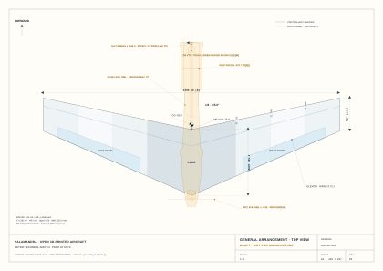

# Salamandra — Design Guide

**Version 0.24** · 19 August 2026 · **RELEASED in v0.6.0**
**Purpose:** concise reconstruction/review specification for the historical v0.6
Article #1 CAD baseline. It is not the active redesigned-aircraft execution specification.

**ENGINEERING HOLD — 21 AUGUST 2026 (ADR-0047).** Do not start or continue the
aerodynamic wing loft from the r1 profiles. The low-speed/full-CG trim gate has
reopened. r1 is reference/coupon geometry; r2a is an E2A test candidate and has no
manufacturing-authoritative coordinate release. Work is limited to reversible
coupon, fixture and test preparation until measured `CL/CD/Cm` selects a profile.

**PROGRAMME RESET — MASTER PLAN v2.0.** Mission, bought-in hardware, sweep family,
directional module and body architecture are now being reselected. This guide is the
historical v0.6 comparison baseline, not the execution specification for new production
CAD. A replacement CAD guide is issued only at
[Master Plan Gate M7](../docs/05-master-plan.md#m7--final-equipment-freeze-body-oml-and-human-cad-handoff).

> **CAD DESIGNER:** do not begin production CAD from this edition. For reversible review
> or historical reconstruction, model only the requirements in this document and do not
> infer missing geometry from renders or sketches. For the active work order, start with
> the [Master Design Plan](../docs/05-master-plan.md) and the
> [active Article #1 requirements](../docs/00-objectives-and-requirements.md). The
> [MP-02 ADR disposition ledger](../decisions/REDESIGN-DISPOSITION.md) determines which
> historical decisions may inform, but not constrain, the redesign. The
> [MP-03 hardware manifest](../docs/17-article-1-hardware-manifest.md) is the current
> candidate equipment/power interface, but it does not authorize equipment stations or
> production CAD before physical measurement and mass-skeleton closure.

This edition releases the **twin-fin V1 architecture** and the generated **provisional
fuselage OML**. The wing, airfoil, twist, elevons, materials, loads and flight limits are
unchanged from v0.23; any V1 fin or carrier solid modelled from v0.23 is obsolete. See
[`docs/16-release-v0.6.md`](../docs/16-release-v0.6.md).

---

## 1. Document control

| Field | Requirement |
|---|---|
| Configuration | Cruise — Article #1 |
| Directional variants | `SALAMANDRA-CLEAN` and `SALAMANDRA-V1` |
| CAD authority | Historical v0.6 reconstruction/review only; active production CAD blocked by Master Plan v2.0 |
| Numerical owners | `calculations/design_config.py` and the generated airfoil coordinate files |
| Active redesign mission | [Article #1 requirements v2.0](../docs/00-objectives-and-requirements.md); this guide does not supersede it |
| Detailed engineering authority | [Advanced Design Guide](Salamandra-Design-Guide-Advanced-v0.1.md) |
| Status | Historical v0.24 baseline under ADR-0047 aerodynamic design hold |

### 1.1 Rules for use

1. Do not start a new production wing/body model until Master Plan Gate M7. Reversible
   review work may use this historical baseline only where it cannot freeze a redesigned
   aircraft decision.
2. Use named parameters for every value marked `FIXED` or `PROVISIONAL`.
3. Import the released `.dat` profiles; do not redraw or rescale them.
4. Treat generated SVG sheets as design-review aids, not manufacturing authority.
5. If this guide conflicts with a numerical owner, stop and report the conflict. Do not
   average values or choose one silently.
6. Do not release printable parts until every item in §12 is closed or explicitly waived.

### 1.2 Status language

| Mark | Meaning for CAD |
|---|---|
| `FIXED` | Model exactly; a change requires a new controlled revision |
| `PROVISIONAL` | Model parametrically; approval or measurement is still required |
| `DESIGNER` | Shape is free inside the stated envelope and interfaces |
| `DO NOT MODEL` | Excluded from Article #1 |
| `[M] [D] [E] [I]` | Measured, derived, estimated and inferred data respectively |

---

## 2. CAD conventions

| Item | Definition |
|---|---|
| Origin | Root quarter-chord at aircraft centreline and section mid-plane |
| +x | Aft, toward the trailing edge |
| +y | Aircraft right; right half-span is 0…650 mm |
| +z | Up |
| Sweep | Negative is forward sweep |
| Twist | Positive is wash-in; rotate about local quarter-chord |
| Dihedral | Positive places the tip upward |
| CAD units | Millimetres, degrees and grams |

Model the aircraft in flight coordinates. Print orientation belongs in the slicer, not
in the aircraft master model.

---

## 3. Released configuration

| Parameter | CAD value | Status |
|---|---:|---|
| Configuration | Forward-swept tailless wing; modular CORE + PANEL | `FIXED` |
| Wingspan | 1300 mm | `FIXED [D]` |
| Wing area | 0.282 m² | `FIXED [D]` |
| Root / tip chord | 289.2 / 144.6 mm | `FIXED [D]` |
| Quarter-chord sweep | −15.0° | `FIXED [D]` |
| Root / tip thickness | 13.5 / 9.0 % chord | `FIXED [D]` |
| Twist | 0° root to +3.0° tip, linear wash-in | `FIXED [D]` |
| Dihedral | Piecewise-flat polyhedral; §4.3 | `PROVISIONAL [E]` |
| Elevons | 0.28 c; y = 227.5…585.0 mm | `FIXED [D]` |
| Wing material | Conventional light-colour PETG | `FIXED` |
| Slicer structure | 0.9 mm skin; 5 % gyroid | `FIXED [E]` |
| Battery | 6S1P 21700 P42A, 153.0 × 65.7 × 22.6 mm maximum envelope | `FIXED [M/D]` |
| Propeller envelope | APC-E 8×8, diameter 203.2 mm | `FIXED [M]` |
| Target CG | x = −93.8 mm ±5 mm | `FIXED [D]` |
| Directional configuration | CLEAN without fins or V1 with two fixed fins | `FIXED` |

`SALAMANDRA-CLEAN` and `SALAMANDRA-V1` use the same wing, elevons, servos and
flight-controller installation. V1 adds only two CORE-rooted fixed fins and their short aft root supports.
No movable rudder or flap/flaperon mode is released.

### 3.1 Current SVG drawing set

Open the current general-arrangement sheet before starting the CAD assembly:

The links below point to the canonical generated filenames controlled by
[`geometry/drawings/manifest.json`](../geometry/drawings/manifest.json). The generator
replaces these files in place, so the links always open the **latest published drawing
set**, not an archived export or screenshot.

| CAD task | Current SVG | What to read from it | Authority boundary |
|---|---|---|---|
| Whole-aircraft plan view | [SLM-GA-001 — General arrangement](../geometry/drawings/SLM-GA-001-general-arrangement.svg) | Planform, stations, CG/NP and overall packaging relationship | Planform `[D]`; equipment `[D]/[E]`; OML `[I]` |
| Fuselage/body development | [SLM-FUS-001 — Fuselage OML review](../geometry/drawings/SLM-FUS-001-fuselage-oml-review.svg) | Plan, side and transverse body views with inflated equipment envelopes | OML `[I]`; not a released printable shell |
| CLEAN versus V1 side installation | [SLM-GA-002 — Side elevations](../geometry/drawings/SLM-GA-002-side-elevations.svg) | Motor/propeller relationship, electronics packaging and twin-fin installation | Root/fin `[D]/[E]`; side OML and installation `[I]` |
| V1 fixed fins | [SLM-FIN-001 — Twin-fin review](../geometry/drawings/SLM-FIN-001-fixed-fin-review.svg) | Fin planform, thickness concept, aft booms and propeller-clearance proof | Planform `[D]` on `[E]`; section and attachment `[E]/[I]` |
| Equipment packaging and mass centres | [SLM-EQP-001 — Equipment mass skeleton](../geometry/drawings/SLM-EQP-001-equipment-mass-skeleton.svg) | Component envelopes, mass centres, CLEAN CG and V1 overlay | No fuselage OML or wing-construction authority |
| Wing parts and interfaces | [SLM-WNG-001 — Right half-wing layout](../geometry/drawings/SLM-WNG-001-half-wing-layout.svg) | Segments, elevon bounds, spar/pin, cells and polyhedral inset | Planform/profile `[D]`; structure/polyhedral `[E]/[I]` |

All six sheets are **DRAFT — NOT FOR MANUFACTURE**. Use them to understand spatial
relationships; use the dimensions and parameters in this guide to build CAD. Amber dashed
geometry is provisional and must remain parametric. If a drawing and this guide appear to
disagree, stop and report the conflict rather than tracing or averaging them.

---

## 4. Wing master geometry

### 4.1 Planform controls

Define the right half-wing and mirror it about y = 0.

| Control | Value | Status |
|---|---:|---|
| Root leading edge | (x, y) = (−72.3, 0) mm | `FIXED [D]` |
| Root trailing edge | (x, y) = (+216.9, 0) mm | `FIXED [D]` |
| Tip leading edge | (x, y) = (−210.3, 650) mm | `FIXED [D]` |
| Tip trailing edge | (x, y) = (−65.7, 650) mm | `FIXED [D]` |
| Quarter-chord line | (0, 0) to (−174.2, 650) mm | `FIXED [D]` |
| Chord law | c(y) = 289.2 − 0.2225 y mm | `FIXED [D]` |
| Thickness law | t/c = 13.5 % root to 9.0 % tip, linear | `FIXED [D]` |
| Tip closure | Flat end cap; no winglet | `PROVISIONAL [I]` |

### 4.2 Required loft stations

All x coordinates use the origin in §2. Do not round the imported profile coordinates.

| y | Chord | t/c | xLE | xc/4 | xTE | Purpose |
|---:|---:|---:|---:|---:|---:|---|
| 0.0 | 289.2 | 13.50 % | −72.3 | 0.0 | +216.9 | Root / centreline |
| 130.0 | 260.3 | 12.60 % | −99.9 | −34.8 | +160.4 | In-CORE control |
| 195.0 | 245.8 | 12.15 % | −113.7 | −52.3 | +132.1 | CORE–PANEL joint |
| 325.0 | 216.9 | 11.25 % | −141.3 | −87.1 | +75.6 | Intermediate control |
| 347.0 | 212.0 | 11.10 % | −146.0 | −93.0 | +66.0 | Segment joint 1 |
| 487.5 | 180.8 | 10.12 % | −175.8 | −130.6 | +5.0 | Intermediate control |
| 498.0 | 178.4 | 10.05 % | −178.0 | −133.4 | +0.4 | Segment joint 2 |
| 585.0 | 159.1 | 9.45 % | −196.5 | −156.8 | −37.4 | Elevon and spar end |
| 650.0 | 144.6 | 9.00 % | −210.3 | −174.2 | −65.7 | Tip |

### 4.3 Twist and polyhedral assembly

- Apply linear twist from 0° at y = 0 to +3.0° at y = 650. Rotate every airfoil about
  its local quarter-chord axis. `FIXED [D]`
- Model every printed segment flat. Apply polyhedral only in the assembly.
- Use these global segment angles relative to the CORE plane:

| Part | Span y | Global angle | Change at inboard joint |
|---|---:|---:|---:|
| CORE | 0…195 | 0° | — |
| Segment 1 | 195…347 | +1.07° | +1.07° |
| Segment 2 | 347…498 | +1.53° | +0.46° |
| Segment 3 | 498…650 | +2.00° | +0.47° |

Rotate about the chordwise x-axis through each inboard joint at z = 0. The resulting
tip rise is approximately 12 mm. The complete dihedral schedule is `PROVISIONAL [E]`.

### 4.4 Required modelling sequence

**HOLD:** Steps 2–6 are suspended for a flight article. They may be executed only in a
clearly named r1 comparison coupon or r2a test-coupon configuration.

1. Sketch the LE, TE and quarter-chord control lines.
2. Place the nine released profiles from §5 at their exact y stations.
3. Scale only by the chord values in §4.2 and apply the twist law in §4.3.
4. Loft the continuous aerodynamic surface.
5. Split the master at y = ±195, ±347 and ±498 mm.
6. Create the fixed inboard trailing-edge bridge, elevons and fixed tips per §6.5.
7. Add explicit structural and equipment features; do not rely on slicer infill for
   channels, webs, sockets, collars or hard points.

---

## 5. Airfoil definition

The Salamandra r1 files below are controlled **historical reference and E2A coupon
inputs only**. They are not authorized for a new flight-wing loft after ADR-0047.

| y | Coordinate file | Added reflex | Status |
|---:|---|---:|---|
| 0.0 | `salamandra-root-r1.dat` | 1.00° | `FIXED [D]` |
| 130.0 | `salamandra-r1-y130.dat` | 0.90° | `FIXED [D]` |
| 195.0 | `salamandra-r1-y195.dat` | 0.85° | `FIXED [D]` |
| 325.0 | `salamandra-r1-y325.dat` | 0.75° | `FIXED [D]` |
| 347.0 | `salamandra-r1-y347.dat` | 0.73° | `FIXED [D]` |
| 487.5 | `salamandra-r1-y488.dat` | 0.62° | `FIXED [D]` |
| 498.0 | `salamandra-r1-y498.dat` | 0.62° | `FIXED [D]` |
| 585.0 | `salamandra-r1-y585.dat` | 0.55° | `FIXED [D]` |
| 650.0 | `salamandra-tip-r1.dat` | 0.50° | `FIXED [D]` |

Do not use `mh60-135.dat` or `mh60-9.dat`; they are generator inputs, not released
sections. Keep profile links and twist parameters replaceable for later physical-test
updates. The 13.0 mm tip thickness does not contain a servo.

The r2a test candidate retains the thickness schedule and uses 3.0/2.5 deg added
root/tip reflex, +3 deg wash-in and a 5% nominal static-margin target. It intentionally
has no canonical nine-station DAT release: first close E2A using as-built root/mid/tip
specimens and [ADR-0047](../decisions/ADR-0047-low-speed-trim-redesign-candidate.md).

---

## 6. Parts, structure and interfaces

### 6.1 Required part breakdown

| Part | Quantity | Span or location |
|---|---:|---|
| CORE | 1 | y = −195…+195 mm |
| PANEL segment 1 | 2 | y = 195…347 mm, mirrored |
| PANEL segment 2 | 2 | y = 347…498 mm, mirrored |
| PANEL segment 3 | 2 | y = 498…650 mm, mirrored |
| Elevon | 2 | y = 227.5…585.0 mm, mirrored |
| Battery cradle halves | 2 | Nose boom |
| Nose skid | 1 | Forward crush zone |
| Balance tabs | 2 | CORE underside at target CG |
| V1 aft boom | 2 | y = ±140 mm |
| V1 fixed fin | 2 | One per aft boom |

The CORE–PANEL interfaces are removable. The two joints inside each PANEL are bonded.

### 6.2 Printed shell and internal cells

Model CORE, panels and elevons as solid aerodynamic bodies for slicing with conventional
PETG, 0.4 mm nozzle, 0.2 mm layers, 0.45 mm wall width, two perimeters and 5 % gyroid.
The intended skin is 0.9 mm. `FIXED [E]`

The released slicer orientation is a 45° roll of the airfoil plane about the spanwise
axis, with the leading edge low. Keep the CAD geometry in aircraft coordinates.
`FIXED [D]`

Add these features explicitly in CAD:

| Feature | Requirement | Status |
|---|---|---|
| D-box | x/c = 0.00…0.30 | `PROVISIONAL` |
| Front shear web | 0.9 mm wall at x/c = 0.30 | `PROVISIONAL [E]` |
| Centre closed cell | x/c = 0.30…0.72 | `FIXED` |
| Hinge line | x/c = 0.72 | `FIXED` |
| Hinge/elevon cell | x/c = 0.72…1.00 | `FIXED` |

### 6.3 Spar and removable CORE–PANEL joint

| Feature | PANEL | CORE socket | Status |
|---|---|---|---|
| Main spar | Carbon tube Ø12 × 1.0 mm; bore Ø12.4…12.6 mm at local x/c = 0.25 | Bore Ø12.2…12.4 mm, approximately 70 mm deep | `PROVISIONAL [E]` |
| Anti-rotation pin | Solid carbon Ø6 mm; bore Ø6.3…6.5 mm, 65 mm aft of spar axis | Bore Ø6.1…6.2 mm, approximately 70 mm deep | `PROVISIONAL [E]` |
| Joint-face centres | x = −9.6 mm spar; x = +55.4 mm pin; z = 0 | Same | `FIXED [D]` |
| Physical lengths | Spar approximately 485 mm; pin approximately 140 mm per half-wing | Approximately 70 mm insertion | `PROVISIONAL [D/E]` |

Bond the tube and pin into the PANEL. Leave their approximately 70 mm root projections
unbonded inside the CORE so the panel remains removable. The carbon carries bending and
joint couple; the closed printed shell carries torsion.

### 6.4 Bonded segment joints

- Cuts: y = 347 and 498 mm; segment spans are 152, 151 and 152 mm. `FIXED [D]`
- Use a tenon and PETG adhesive or 30-minute epoxy; bond area at least three times the
  skin section. `FIXED [E]`
- Add two Ø1.8…1.9 mm dowel holes at x/c = 0.40 and 0.60 on each mating face.
- Add an Ø8 × 4 mm solid collar around every dowel hole.
- Use Ø1.75 mm PETG filament dowels during assembly.
- Keep spar and pin bores straight within each flat segment. Their prescribed clearance
  accommodates the small polyhedral changes. `DERIVED`

### 6.5 Elevons and servo installation

| Parameter | Requirement | Status |
|---|---|---|
| Elevon | Separate solid, 0.28 c, y = 227.5…585.0 mm; length 357.5 mm | `FIXED [D]` |
| Fixed root bridge | y = 195.0…227.5 mm; length 32.5 mm | `FIXED [D]` |
| Fixed tip | y = 585.0…650.0 mm; length 65.0 mm | `FIXED [D]` |
| Hinge strip | TPU 95A, 4 × 6 × 357.5 mm | `PROVISIONAL [E]` |
| Hinge groove | 4.2 × 6.2 mm along x/c = 0.72; relief every 30 mm | `PROVISIONAL [E]` |
| Balance pocket | 40 × 14 × 12 mm at local x/c = 0.74; one M2 lid; 40 g capacity | `PROVISIONAL [E]` |
| Balance requirement | Finished elevon CG on the measured hinge line | `FIXED` |
| Servo | One Corona DS-939MG per side; envelope 22.5 × 24.6 × 11.5 mm | `FIXED [M]` |
| Servo centre | y = ±406.25 mm; x/c = 0.5334; x = −52.5 mm; z = +2.4 mm | `FIXED [D]` |
| Local clearances | At least 1.50 mm to skin; nominal pushrod run 37.1 mm | `FIXED [D]` |

Add mounting-lug and cable clearance from a measured procured servo. Use a short,
zero-freeplay linkage. ±20° is a provisional mechanical envelope, not a flight setting.

### 6.6 V1 fixed-fin module

V1 uses two identical fixed fins rooted at y = ±140 mm in the aft CORE. Motor and
propeller stations are fixed; the complete fins and their short aft root supports remain
forward of the inflated propeller hazard. No rudder, linkage or additional servo is
permitted in Article #1.

| Feature | Requirement | Status |
|---|---|---|
| Root-support envelopes | 18 × 14 mm; x = +156.0…+216.6 mm; y = ±140 mm | `PROVISIONAL [I]` |
| Fin root LE / TE | x = +43.6 / +214.6 mm | `FIXED [D]` |
| Fin tip LE / TE | x = +133.8 / +210.8 mm | `FIXED [D]` |
| Fin span | 247.9 mm each | `FIXED [D]` |
| Root / tip chord | 170.9 / 76.9 mm | `FIXED [D]` |
| Leading-edge / quarter-chord sweep | +20.0° / +15.064° | `FIXED [D/E]` |
| Fin aerodynamic centre | x = +115.5 mm; fixed-propeller constrained optimum | `FIXED [D]` |
| Section | Symmetric biconvex; 3.0 mm root to 1.5 mm tip; approximately 0.8 mm TE | `PROVISIONAL [E]` |
| Leading edge | External Ø3 mm aluminium rod in open rear-facing C-seat | `PROVISIONAL [E]` |
| Propeller clearance | Radial support: 29.4 mm nominal / 13.4 mm residual; axial support: 8.33 mm beyond inflated forward hazard; zero side-view overlap | `PROVISIONAL [D/E/I]` |
| Attachment | Provisional Ø1.75 mm alignment dowel plus M2 screw; root fillet contained inside credited planform | `PROVISIONAL [I]` |

Do not create an enclosed Ø3.2 mm bore inside the thin fin. Keep the saddle, load spread,
fillet and attachment hardware parametric for the F2 review.

---

## 7. Mass and balance constraints

### 7.1 CAD mass limits

| Item | Maximum or allocation | Status |
|---|---:|---|
| Complete printed PETG shell | 550 g | `GATE [E]` |
| CORE printed share | 150.1 g | `ALLOCATION [E]` |
| Wing fixed structure | 314.8 g | `ALLOCATION [E]` |
| Tip closures | 40.0 g | `ALLOCATION [E]` |
| Two moving elevons | 45.0 g | `ALLOCATION [E]` |
| Elevon balance mass | 54 g total; final value by measured balance | `ALLOCATION [D/E]` |
| Complete V1 fin/support module | 60.0 g maximum; 48.73 g analytical lower model | `GATE [D/E]` |
| CLEAN all-up mass | 1553.25 g analytical | `GATE [D/E]` |
| V1 all-up mass | 1601.98 g coupled analytical; absolute stall-model ceiling 1620.4 g | `GATE [D/E]` |

The CAD handoff must include mass and centre-of-mass reports for every printed part,
the CLEAN assembly and the V1 module. A mass estimate without assigned material and
density is not acceptable.

### 7.2 CG target

| Quantity | Requirement | Status |
|---|---|---|
| Target aircraft CG | x = −93.8 mm from root quarter-chord | `FIXED [D]` |
| Acceptance band | ±5 mm | `FIXED` |
| Equivalent root reference | 21.5 mm forward of root leading edge | `FIXED [D]` |
| CLEAN pack centre | x = −337.74 mm | `FIXED [D]` |
| CLEAN pack-centre travel | x = −371.20…−336.10 mm | `PROVISIONAL [D]` |
| Coupled V1 pack-centre travel | x = −371.20…−336.10 mm; no nose extension required | `PROVISIONAL [D/I]` |
| V1 required / solved pack centre | x = −363.27 / −363.27 mm | `FIXED [D]` |

The coupled V1 solver retains the CLEAN forward structure, adds no tube/cradle support,
and converges to the target CG in one iteration. This is analytical
packaging closure, not CAD or physical closure. Keep the cradle, equipment stations and
linear-mass assumptions parametric and verify them at F2.

---

## 8. CORE and equipment packaging

The exterior CORE/body shape is `DESIGNER` geometry inside the fixed interfaces and
equipment envelopes below. It remains `PROVISIONAL` until F2. The wing aerodynamic
surface must remain continuous across y = −195…+195 mm, and the CORE trailing edge is
fixed; there is no inboard elevon.

| Feature | CAD requirement | Status |
|---|---|---|
| Nose boom | Aluminium Ø8 / Ø6 internal; CORE support near x = −132 mm; 50 mm insertion | `PROVISIONAL [D/E]` |
| Forward cradle plane | CLEAN/V1 x = −452.70 mm | `PROVISIONAL [D/I]` |
| CORE boom socket | Ø8.2 mm bore at y = 0, z = 0; four-perimeter collar | `PROVISIONAL` |
| Battery cradle | CLEAN/V1 201 mm / 15.0 g; 68 × 25 mm internal; 1.2 mm walls | `PROVISIONAL [D/E/I]` |
| Battery retention | Two 12 mm straps and spring-lock hatch | `PROVISIONAL [E]` |
| Camera | DJI O4 envelope 13.44 × 12.36 × 16.50 mm; CLEAN/V1 centre x = −445.98 mm; lens faces −x | `FIXED [M/D]` |
| VTX | 30 × 30 × 6 mm; CLEAN/V1 centre x = −418.0 mm, z = +31.5 mm; provide airflow | `FIXED [M/D]` |
| Camera–VTX cable | CLEAN/V1 centre-distance lower bound 45.99 mm; routing and bend radius unresolved | `PROVISIONAL [D/I]` |
| Body OML length | CLEAN/V1 = 739.70 mm; generated from the respective layout | `PROVISIONAL [D/I]` |
| FC cavity | 64 × 45 × 21 mm with 30.5 × 30.5 mm, Ø4 mm mounting pattern | `PROVISIONAL [M]` |
| FC station | Approximately x = 0…+40 mm | `PROVISIONAL [E]` |
| ESC station | Approximately x = +60 mm | `PROVISIONAL [E]` |
| GPS/magnetometer | Nose pedestal near x = −120 mm, separated from high-current wiring | `PROVISIONAL [E]` |
| Pitot | Leading edge near y = 260 mm; dedicated pressure-line route across y = 195 mm, clear of sockets | `PROVISIONAL [E]` |
| Motor mount face | Approximately x = +230 mm; motor body x = +195…+230 mm | `PROVISIONAL [E]` |
| Propeller plane | Approximately x = +235 mm; at least 10 mm aft of root TE | `PROVISIONAL [E]` |
| Motor/thrust axis | z = 0; 0.8° upthrust | `PROVISIONAL [M/E]` |
| Rear-pod lower surface | At propeller plane, z ≤ −111.6 mm for 10 mm ground clearance | `PROVISIONAL [D]` |

Required access features: removable battery, serviceable avionics, cooling for ESC/VTX,
unobstructed camera view, cable strain relief, hand-launch grip, crushable nose skid and
two balance tabs at the target CG.

---

## 9. Propulsion installation envelope

Article #1 uses a centreline pusher envelope. The exact motor selection remains
provisional, but CAD shall reserve the following:

| Item | Requirement | Status |
|---|---|---|
| Propeller | APC-E 8×8, Ø203.2 mm disk | `FIXED [M]` |
| Motor | 28-class, 500…550 Kv, approximately 170 g, at least 400 W peak | `PROVISIONAL [E]` |
| ESC | 6S, 30 A, approximately 35 g | `PROVISIONAL [E]` |
| Propeller clearance | V1 booms retain 29.4 mm nominal / 13.4 mm residual radial clearance after the 16.0 mm `[E]/[I]` allowance | `PROVISIONAL [D/E/I]` |
| Ground clearance | At least 10 mm at the defined keel plane | `PROVISIONAL [D]` |

Do not enlarge the propeller, change battery voltage, or move the motor station without a
new propulsion and balance check.

---

## 10. Avionics and routing

- Flight controller: SpeedyBee F405 WING with PDB/current board, 20.3 g installed.
  Reserve pitot, current sensing, GPS/magnetometer, receiver and blackbox connections.
- Servos: exactly two DS-939MG units, one per elevon.
- FPV: DJI O4 camera and VTX envelopes in §8; Article #1 operates them from the 5 V rail.
- Separate the battery–ESC current path from GPS/magnetometer, pitot and FPV routing.
- Provide a dedicated pressure-line path through the removable PANEL interface.
- Provide connector access, cable bend radius, strain relief and cooling paths.
- Do not model O4 Pro, O3, a third servo, rudder actuator or alternate battery as if it
  were Article #1. Each requires a new packaging and mass check.

---

## 11. Structural design cases and unresolved constraints

Use these cases for CAD load paths and interface design. They are not flight commands.

| Requirement | Value | Status |
|---|---:|---|
| Manoeuvre limit load | +6 / −3 g | `PROVISIONAL [E]` |
| Structural ultimate load | +9 / −4.5 g | `PROVISIONAL [D]` |
| Initial operational speed limit | 105 km/h | `FIXED [D]` |
| Article #1 VNE | 160 km/h | `FIXED` |
| Initial material | Conventional PETG only | `FIXED` |
| Carbon function | Bending and joint couple, not primary torsion | `FIXED` |
| Primary torsion path | Closed printed shell and explicit shear web | `FIXED/PROVISIONAL` |

The following items remain open and must not be frozen invisibly in CAD:

- CORE outer mould line and its union with the wing;
- local load paths around joiner sockets, motor mount, boom socket and V1 saddles;
- print compensation and verified sliding/bonded fits;
- measured PETG properties, torsional stiffness and elastic-axis location;
- cooling, cable routing and service openings;
- V1 mass/CG closure;
- hinge stiffness, elevon modal behaviour and final balance mass.

---

## 12. CAD handoff and acceptance checklist

### 12.1 Required deliverables

- Native parametric CAD assembly with named master parameters.
- Separate bodies/components matching §6.1.
- STEP export for geometry review; STL/3MF only after release approval.
- Mass and centre-of-mass report by part and configuration.
- Section/interference views for every joint, equipment cavity and propeller envelope.
- Parameter table identifying every `PROVISIONAL` value used.
- Short deviation register listing any requirement not achieved exactly.

### 12.2 Review gates

- [ ] Coordinate system, handedness and units match §2.
- [ ] Planform corners and all nine loft stations match §4.
- [ ] No flight-wing loft uses r1 or r2a before ADR-0047/E2A closure.
- [ ] Twist is about local quarter-chord; polyhedral is applied only in assembly.
- [ ] CORE and three PANEL segments per side are separate components.
- [ ] CORE–PANEL joints are removable; internal PANEL joints are bonded.
- [ ] Spar, pin, dowel, hinge, servo and balance-pocket features are explicit.
- [ ] Elevon span is 357.5 mm, with 32.5 mm fixed root bridge and 65 mm fixed tip.
- [ ] CLEAN and V1 are separate configurations; V1 contains two fixed fins and no rudder.
- [ ] Battery, camera, VTX, FC, ESC, pitot, motor and propeller envelopes have no clashes.
- [ ] Propeller-to-wing, propeller-to-boom and ground-clearance requirements pass.
- [ ] Printed shell and V1 module meet the §7 mass allocations.
- [ ] CLEAN CG closes; the known V1 cradle-travel conflict is explicitly reported.
- [ ] All provisional geometry remains editable through named parameters.
- [ ] No manufacturing-release label is applied before physical gates close.

---

## 13. Compact source map

Use these only when the concise requirement needs interpretation.

| Need | Canonical source |
|---|---|
| Full calculations, migration history and technical boundaries | [Advanced Design Guide](Salamandra-Design-Guide-Advanced-v0.1.md) |
| Why values were selected | [Design Guide Justification](Design-Guide-Justification-v0.1.md) |
| Unresolved tests and decisions | [Design Guide Open Points](Design-Guide-Open-Points-v0.1.md) |
| Shared numerical inputs | `calculations/design_config.py` |
| Historical/coupon profiles | `geometry/airfoils/salamandra-*-r1.dat` |
| Low-speed trim hold and candidate | [ADR-0047](../decisions/ADR-0047-low-speed-trim-redesign-candidate.md) |
| Visual arrangement | [SLM-GA-001](../geometry/drawings/SLM-GA-001-general-arrangement.svg) |
| Wing interfaces | [SLM-WNG-001](../geometry/drawings/SLM-WNG-001-half-wing-layout.svg) |
| Equipment envelopes | [SLM-EQP-001](../geometry/drawings/SLM-EQP-001-equipment-mass-skeleton.svg) |
| V1 fin module | [SLM-FIN-001](../geometry/drawings/SLM-FIN-001-fixed-fin-review.svg) |
| Current release rules | `docs/13-release-v0.5.md` |

**Editorial revision:** 19 August 2026 — created the concise canonical CAD guide and
renamed the former full guide as the Advanced Design Guide. No technical value changed.

**Engineering hold addendum:** 21 August 2026 — ADR-0047 reopened the airfoil/trim and
CG decision after the operating-`Cm(CL)` analysis. This addendum changes authorization,
not the historical v0.24 geometry.
